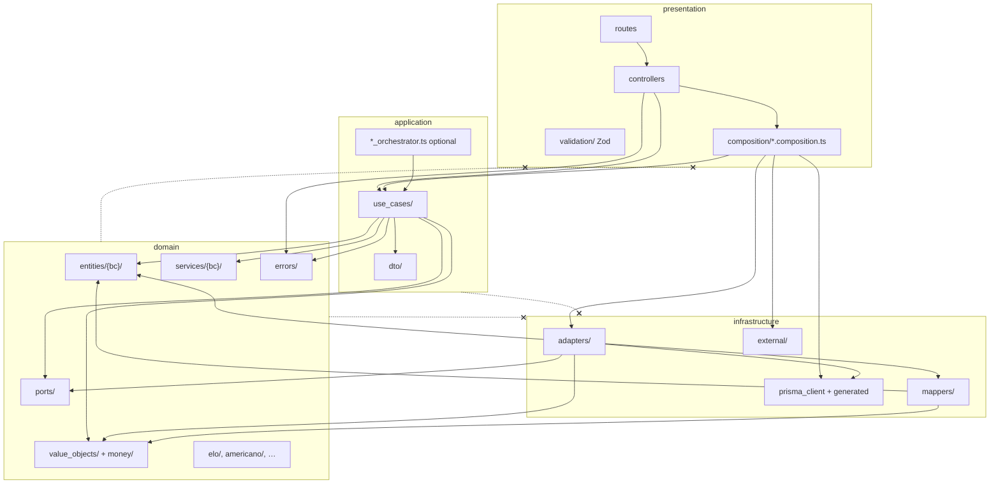
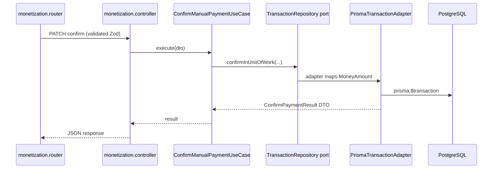
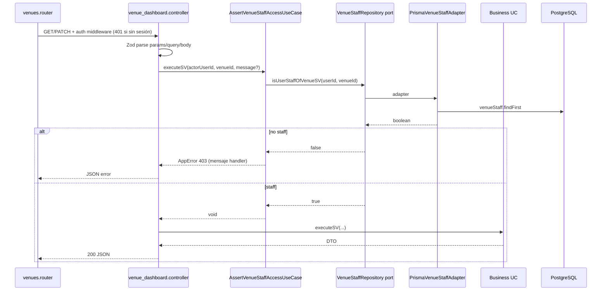

# Design: Refactor Clean Architecture — `services/api`

| Campo | Valor |
|-------|-------|
| **Change** | `api-architecture-refactor` |
| **Modo** | hybrid (este archivo + Engram `sdd/api-architecture-refactor/design`) |
| **Referencias** | `proposal.md`, `exploration.md`, `payment-domain-refactor/exploration.md` |

---

## 1. Technical Approach

**Estrategia strangler por olas (0–6)** sobre `services/api/src`, sin big-bang ni cambios de stack. Cada ola sigue el mismo micro-ciclo por bounded context:

1. **Domain** — entities/VO por BC, ports nuevos o endurecidos, domain services sin IO.
2. **Infrastructure** — `adapters/prisma_*` + `mappers/*` (Prisma → entity/VO); deprecar funciones en `repositories/`.
3. **Application** — un use case por acción HTTP; orquestador delgado opcional por BC; **cero** imports infra/Prisma.
4. **Presentation** — `composition/*.composition.ts` como único wiring; controllers/routes skinny.
5. **Delete legacy** — solo cuando `rg` reporte **0 imports** del `*.service.ts` o repo función.

**Patrones internos (copiar):**

| Gold | Anti |
|------|------|
| `transaction_receipts.composition.ts` + UC con ports | `bookings.controller.ts` (DI inline, ignora composition) |
| `matches.composition.ts` (singletons + `*_UC` exportados) | `monetization.service.ts` (god service + repos función) |

**Gate producto:** Wave **0** (ESLint + `MoneyAmount` + `ARCHITECTURE.md`) + Wave **1** vía child **`payment-domain-refactor`** → desbloquea **`multi-currency-payments`**. No mergear schema MCP hasta gate verde.

**Verificación por PR/wave:** `npm run typecheck` → `npm run lint` → `npm test` (orden fijo en `openspec/config.yaml`).

```text
Wave 0 ──► estándares + money VO + ESLint ampliado + domain tree
    │
    ▼
Wave 1 ──► payment-domain-refactor (6 PRs) ──► GATE MCP
    │
    ├── Wave 2 Booking/Venue
    ├── Wave 3 Match/Tournament
    ├── Wave 4 Identity
    ├── Wave 5 Social
    └── Wave 6 Platform (ranking, routers huérfanos, delete repos restantes)
```

---

## 2. Architecture Decisions

### Decision 1: `domain/ports/` (hexagonal), no `domain/repositories/`

| | |
|---|---|
| **Choice** | Mantener **`domain/ports/`** como único lugar de contratos de persistencia/externos. **Eliminar** `domain/repositories/` (carpeta vacía con `.gitkeep`). |
| **Alternatives** | Renombrar `ports` → `repositories` (DDD clásico); duplicar ambas carpetas. |
| **Rationale** | ~62 ports ya existen; 0 violaciones domain→infra. Renombrar es churn masivo sin beneficio. La confusión ports vs `infrastructure/repositories/` se resuelve con lint + `ARCHITECTURE.md`, no con duplicar interfaces en domain. |

### Decision 2: Composition root único en `presentation/composition/`

| | |
|---|---|
| **Choice** | Todo DI en `presentation/composition/{feature}.composition.ts`. Controllers importan **solo** `*_UC` exportados (+ errores domain + tipos DTO si aplica). |
| **Alternatives** | DI en controllers (AS-IS bookings); contenedor IoC global (tsyringe). |
| **Rationale** | 27 compositions ya existen; `bookings.composition.ts` demuestra el patrón pero está **huérfano**. IoC global añade dependencia y oculta el grafo por feature. Matches/receipts validan el patrón actual del repo. |

### Decision 3: ESLint flat config — ampliar `no-restricted-imports` por capa (Wave 0)

| | |
|---|---|
| **Choice** | Extender `eslint.config.mjs` con bloques por glob (ver §5). **Error** en CI; overrides temporales por carpeta máximo 1 sprint si bloquea merge paralelo. |
| **Alternatives** | Solo documentación; `dependency-cruiser` / `eslint-plugin-boundaries`. |
| **Rationale** | Ya existe regla parcial en `use_cases/**` y `domain/**`; AS-IS sigue con 10 application→infra y 9 controllers→infra. ESLint es feedback inmediato en IDE y CI sin nueva herramienta. |

### Decision 4: Naming adapters — `Prisma{Aggregate}Adapter` en `infrastructure/adapters/`

| | |
|---|---|
| **Choice** | Clase `PrismaXxxAdapter` implementa `IXxxRepository` (port). Archivo: `infrastructure/adapters/prisma_xxx_adapter.ts` o `prisma_xxx_repository.ts` **solo si** ya existe convención local (`PrismaMatchRepository`). |
| **Alternatives** | Mantener `findXRepo()` sueltos; sufijo `Repository` solo en domain ports. |
| **Rationale** | 59 adapters existentes usan prefijo `Prisma*`. Repos función (15) migran a clase adapter + mapper; un export por port. Evitar nuevo estilo `*Repo` en infra. |

### Decision 5: `MoneyAmount` en `domain/money/` (global fintech VO)

| | |
|---|---|
| **Choice** | `CurrencyCode`, `MoneyAmount`, `ExchangeRateSnapshot`, `money_errors.ts` bajo **`domain/money/`**. IDs tipados y refs de pago en `domain/value_objects/`. |
| **Alternatives** | Solo `value_objects/money_amount.ts`; usar `decimal.js` en application. |
| **Rationale** | MCP y Wave 1 asumen paquete money explícito. Separar money global de VOs por BC reduce acoplamiento booking↔payments. Suma/multiplicación solo misma moneda — invariante en VO, no en Prisma. |

### Decision 6: Orden de migración — Wave 0 → payment child → MCP; BCs por valor fintech

| | |
|---|---|
| **Choice** | **0** fundaciones → **1** Payments (child) → gate → **2** Booking (precio reserva) → **3** Match/Tournament → **4–6** por tráfico/deuda. |
| **Alternatives** | Booking antes que Payments; refactor horizontal “todos los repos” en Wave 0. |
| **Rationale** | 62% application BC pagos importa infra; bug `amountTotal × 100` bloquea MCP. Booking depende de totales correctos post-money. Wave 0 no toca 15 repos — solo estándares y VO — para PR reviewable. |

### Decision 7: Application sin `*.service.ts` nuevos; strangler hasta 0 imports

| | |
|---|---|
| **Choice** | Prohibir nuevos `application/*.service.ts` (lint + review). Legacy delega a UC nuevo hasta borrado. |
| **Alternatives** | Renombrar services a `*_orchestrator.ts` sin cambiar dependencias. |
| **Rationale** | 9 god services son el síntoma; renombrar perpetúa imports infra. `PaymentOrchestrator` (Wave 1) es facade **sin** Prisma. |

### Decision 8: Validación Zod solo en `presentation/validation/`

| | |
|---|---|
| **Choice** | Unificar `validators/booking.schemas.ts` → `validation/bookings.validation.ts`; no nuevos `presentation/validators/`. |
| **Alternatives** | Zod en application; class-validator. |
| **Rationale** | Alineado con 40+ archivos `*.validation.ts` existentes. Domain validation solo para reglas puras sin IO. |

---

## 3. Layer Dependency Diagram



**Regla:** flechas de dependencia solo hacia dentro. `composition` es la **única** capa presentation que importa `infrastructure`.

---

## 4. Target Folder Tree — `services/api/src/domain/`

```text
domain/
  errors/
    app_error.ts
  money/                              # Wave 0 — global fintech
    currency_code.ts
    money_amount.ts
    money_amount_ops.ts
    exchange_rate_snapshot.ts
    money_errors.ts
  value_objects/
    identifiers.ts                    # ReservationId, TransactionId, …
    payment_reference.ts              # según Wave 1
  entities/
    shared/                           # enums cross-BC si aplica
    booking/
      reservation.entity.ts           # mover desde entities/reservation.entity.ts
      court.entity.ts                 # mover desde entities/court.entity.ts
    payments/
      payment_obligation.entity.ts    # Wave 1 child
      venue_payment_method.entity.ts  # mover
      exchange_rate.entity.ts         # mover
    catalog/                          # Wave 6 — si se extraen de ports
  services/
    payments/
      fee_policy.service.ts           # migrar fee_calculation desde monetization/
      payment_allocation.service.ts   # Wave 1
    booking/
      pricing.service.ts              # total court + duration, sin IO
  ports/                              # 62+ interfaces — sin cambio de nombre
    transaction_repository.ts         # Wave 1 — nuevo
    …
  elo/                                # lógica pura legacy — mantener
  americano/
  single_elimination/
  round_robin/
  monetization/                       # DEPRECAR → services/payments/ (Wave 1)
    fee_calculation.ts
# ELIMINAR: repositories/ (.gitkeep)
```

**Mappers (infra, no domain):** `infrastructure/mappers/{bc}_*.mapper.ts` — Prisma row → `entities` / `money` VO.

---

## 5. ESLint `no-restricted-imports` — Config Wave 0

Reemplazar/ampliar bloques en `services/api/eslint.config.mjs`. Mantener `ignores` de `src/generated/**`.

```javascript
// --- domain: cero dependencias externas de capa ---
{
  files: ['src/domain/**/*.ts'],
  rules: {
    'no-restricted-imports': ['error', {
      paths: [
        { name: '../../infrastructure', message: 'domain MUST NOT import infrastructure' },
        { name: '../../../infrastructure', message: 'domain MUST NOT import infrastructure' },
        { name: '../../generated/prisma', message: 'domain MUST NOT import Prisma generated' },
        { name: '../../../generated/prisma', message: 'domain MUST NOT import Prisma generated' },
        { name: '../../presentation', message: 'domain MUST NOT import presentation' },
      ],
      patterns: [
        { group: ['**/infrastructure/**'], message: 'domain MUST NOT import infrastructure' },
        { group: ['**/generated/prisma', '**/generated/prisma/**'], message: 'domain MUST NOT import Prisma' },
        { group: ['**/presentation/**'], message: 'domain MUST NOT import presentation' },
        { group: ['../application/**', '../../application/**'], message: 'domain MUST NOT import application' },
      ],
    }],
  },
},

// --- application (TODA la carpeta, no solo use_cases) ---
{
  files: ['src/application/**/*.ts'],
  rules: {
    'no-restricted-imports': ['error', {
      patterns: [
        { group: ['**/infrastructure/**'], message: 'application MUST NOT import infrastructure — use domain ports' },
        { group: ['**/generated/prisma', '**/generated/prisma/**'], message: 'application MUST NOT import Prisma' },
        { group: ['**/presentation/**'], message: 'application MUST NOT import presentation' },
      ],
    }],
    'no-restricted-syntax': ['error', {
      selector: 'ImportDeclaration[source.value=/\\.service\\.ts$/]',
      message: 'Prohibido nuevo application/*.service.ts — usar use_cases + composition',
    }],
  },
},

// --- presentation controllers ---
{
  files: ['src/presentation/controllers/**/*.ts'],
  rules: {
    'no-restricted-imports': ['error', {
      patterns: [
        { group: ['**/infrastructure/**'], message: 'controllers MUST NOT import infrastructure — use composition * _UC' },
        { group: ['**/generated/prisma/**'], message: 'controllers MUST NOT import Prisma' },
      ],
    }],
  },
},

// --- presentation routes ---
{
  files: ['src/presentation/routes/**/*.ts'],
  rules: {
    'no-restricted-imports': ['error', {
      patterns: [
        { group: ['**/infrastructure/**'], message: 'routes MUST NOT import infrastructure' },
        { group: ['**/application/**/*.service'], message: 'routes MUST NOT call god services' },
      ],
    }],
  },
},

// --- composition: ÚNICO lugar presentation→infrastructure ---
// (sin regla extra — allowed by design)
```

**Rollout lint:** PR Wave 0a añade reglas con `warn` en archivos violadores listados en exploration §1.1; PR Wave 0b sube a `error` tras fixes o `eslint-disable-next-line` documentado con ticket. Objetivo: **0 violaciones** en `domain/` y `application/` antes de cerrar Wave 0.

---

## 6. Template `*.composition.ts`

Basado en `matches.composition.ts` y `transaction_receipts.composition.ts`:

```typescript
/**
 * Composición — {FeatureName}
 * Único wiring: adapters + use cases exportados como *_UC
 */

import { SomeUseCase } from '../../application/use_cases/some.use_case.js';
import { PrismaSomeAdapter } from '../../infrastructure/adapters/prisma_some_adapter.js';
// import cross-feature UC from './other.composition.js' — evitar ciclos

const SOME_REPOSITORY = new PrismaSomeAdapter(/* PRISMA si ctor lo requiere */);

export const SOME_ACTION_UC = new SomeUseCase(SOME_REPOSITORY);

// Controller importa solo:
// import { SOME_ACTION_UC } from '../composition/some.composition.js';
```

**Reglas composition:**

| Regla | Detalle |
|-------|---------|
| Constantes módulo | `UPPER_SNAKE` para adapters/repos compartidos en el archivo |
| Exports públicos | Solo `*_UC` (y opcionalmente factories para tests) |
| Prisma | Solo aquí o dentro de adapters — **nunca** pasar `PRISMA` a UC (deuda: `GET_MATCH_PAYMENT_INFO_UC` en matches — fix Wave 1/3) |
| Cross-feature | Importar `*_UC` de otra composition (ej. receipts → notifications) |
| Anti-patrón | Duplicar este archivo inline en controller |

---

## 7. Wave 0 — File Change List (actionable)

| # | Archivo / acción | Acción | Descripción |
|---|------------------|--------|-------------|
| W0-1 | `services/api/ARCHITECTURE.md` | Create | Diagrama capas, árbol domain, reglas 1–5, gold/anti ejemplos |
| W0-2 | `services/api/eslint.config.mjs` | Modify | §5 rules + rollout warn→error |
| W0-3 | `domain/money/*.ts` | Create | `CurrencyCode`, `MoneyAmount`, ops, errors, unit tests |
| W0-4 | `domain/value_objects/identifiers.ts` | Create | IDs tipados mínimos (extensible) |
| W0-5 | `domain/entities/booking/*` | Move | `reservation.entity.ts`, `court.entity.ts` desde `entities/` |
| W0-6 | `domain/entities/payments/*` | Move | `exchange_rate`, `venue_payment_method` entities |
| W0-7 | `domain/repositories/` | Delete | Eliminar carpeta vacía |
| W0-8 | `domain/services/payments/fee_policy.service.ts` | Create | Extraer lógica de `monetization/fee_calculation.ts` |
| W0-9 | `presentation/middlewares/` | Delete/Merge | Unificar en `presentation/middleware/` |
| W0-10 | `presentation/validators/booking.schemas.ts` | Move | → `validation/bookings.validation.ts` + actualizar imports |
| W0-11 | `AGENTS.md` | Modify | Link a `ARCHITECTURE.md` |
| W0-12 | `src/test/unit/money_amount.test.ts` | Create | Golden: misma moneda, reject cross-currency sum |
| W0-13 | Violadores lint (10 app + 9 ctrl) | Modify | Fix imports o baseline documentado — ver exploration §1.1, §7 |
| W0-14 | `openspec/changes/api-architecture-refactor/tasks.md` | Create | (sdd-tasks) checklist Wave 0 |

**No en Wave 0:** borrar `*.service.ts`, migrar 15 repos, schema Prisma MCP.

---

## 8. Deprecation Tables

### 8.1 Application `*.service.ts` (9) → destino

| Legacy service | Imports infra | Target (Wave) | Reemplazo |
|----------------|---------------|---------------|-----------|
| `monetization.service.ts` | 5 repos | **1** | `PaymentOrchestrator` + UCs (`confirm_manual_payment`, obligations, summaries) + `monetization.composition.ts` |
| `americano.service.ts` | 7 repos | **3** | `CreateAmericanoUseCase`, … + `americano.composition.ts` |
| `parametrized_tournament.service.ts` | — | **3** | Tournament UCs + composition existente extendida |
| `services/tournament_format_parameters_validator.service.ts` | — | **3** | `domain/services/` o port `TournamentFormatParametersValidator` |
| `ranking.service.ts` | 2 repos | **6** | Ranking UCs + `ranking.composition.ts` |
| `matchmaking.service.ts` | 3 repos | **6** | Matchmaking UCs |
| `auth.service.ts` | — | **4** | Auth UCs (`auth.composition.ts` ya existe — migrar llamadas) |
| `profile.service.ts` | — | **4** | Profile UCs |
| `catalog.service.ts` | — | **6** | Catalog UCs |

**Criterio borrado:** `rg "monetization.service"` → 0 hits; luego delete file.

### 8.2 `infrastructure/repositories/` (15) → adapter / wave

| Repo función | Consumidores típicos | Target adapter / mapper | Wave |
|--------------|---------------------|-------------------------|------|
| `transaction.repository.ts` | monetization, confirm UC | `adapters/prisma_transaction_repository.ts` | **1** |
| `fee_rule.repository.ts` | monetization | `adapters/prisma_venue_fee_rule_repository.ts` | **1** |
| `exchange_rate.repository.ts` | router, monetization | `adapters/prisma_exchange_rate_repository.ts` | **1** |
| `venue_payment_method.repository.ts` | router | `adapters/prisma_venue_payment_method_repository.ts` | **1** |
| `court.repository.ts` | bookings, venues | `adapters/prisma_court_repository.ts` implements `CourtRepository` port | **2** |
| `court_repository_factory.ts` | venues controller | Inline en `venues.composition.ts` | **2** |
| `prisma_court_mapper.ts` | court repo | `mappers/court.mapper.ts` | **2** |
| `reservation.repository.ts` | monetization, booking | `prisma_reservation_repository` adapter (exists) — unify | **2** |
| `match.repository.ts` | americano, monetization | Consolidar en match adapters existentes | **3** |
| `tournament.repository.ts` | tournaments | `prisma_tournament_repository` adapter | **3** |
| `user.repository.ts` | user_search controller | `prisma_user_repository` adapter | **4** |
| `ranking.repository.ts` | ranking.service | `prisma_ranking_repository` adapter | **6** |
| `category.repository.ts` | americano | `prisma_category_repository` adapter | **6** |
| `sport.repository.ts` | catalog | `prisma_sport_repository` adapter | **6** |
| `format_preset.repository.ts` | tournaments | `prisma_format_preset_repository` adapter | **6** |

**Post Wave 6:** eliminar carpeta `infrastructure/repositories/` completa.

---

## 9. Integration — Child Changes & MCP Gate

```text
api-architecture-refactor
├── Wave 0 (este design §7) ─────────────────────────────┐
│                                                          │
└── Wave 1 = payment-domain-refactor (6 PRs R1–R6) ◄──────┘
         │
         │ GATE (todas obligatorias):
         │  • ESLint 0 violaciones domain + application
         │  • MoneyAmount + tests golden en CI
         │  • TransactionRepository port + PrismaTransactionAdapter
         │  • ConfirmManualPaymentUseCase sin Prisma
         │  • monetization.service.ts eliminado (0 imports)
         │  • exchange_rate + venue_payment_method routers → UC
         │
         ▼
multi-currency-payments
    M1 schema (effectiveDate, settlementCurrency, …)
    M2+ comportamiento cross-currency, web UI, flag
```

| Requisito MCP | Proveedor |
|---------------|-----------|
| `MoneyAmount`, `CurrencyCode` | Wave **0** |
| Ports TX, fee, conversion | Wave **1** R1–R2 |
| Confirm/sync sin Prisma | Wave **1** R3 |
| `PaymentOrchestrator` | Wave **1** R4 |
| Routers sin infra | Wave **1** R5 |
| Tests golden conversión | Wave **1** R1 + MCP M2 |
| Schema Prisma MCP | **Solo** en `multi-currency-payments` M1 post-gate |

**Scope firewall Wave 1:** child **no** incluye columnas MCP ni `MULTI_CURRENCY_PAYMENTS` behavior — solo arquitectura y paridad funcional AS-IS corregida (agregación en pricing currency).

**Contrato con web/mobile:** congelar shape JSON de `MoneyAmount` en spec MCP; clients mockean hasta gate. Cambios HTTP breaking solo en olas que toquen endpoints (Wave 1 confirm/summary).

---

## 10. Testing Strategy per Wave

| Wave | Unit (Vitest) | Contract (Zod/HTTP 400) | Integration (TEST_DATABASE_URL) |
|------|---------------|---------------------------|----------------------------------|
| **0** | `money_amount.test.ts`, `currency_code.test.ts` | — | — |
| **1** (child) | `money_conversion.golden.test.ts`, `payment_obligation.test.ts`, `sync_reservation_payment.test.ts` | `monetization.validation.test.ts` (existente) | Confirm manual + sync reserva + obligations (ampliar `monetization.integration.test.ts`) |
| **2** | Pricing domain service | `bookings.validation` tras move | Booking create/cancel con totales |
| **3** | Americano schedule (domain puro) | Tournament routes | Match flows sin service |
| **4–5** | Auth/profile helpers | Auth validation | Login/refresh smoke |
| **6** | Ranking aggregation | — | Exchange rate UC + geo si aplica |

**CI gate por PR:** `typecheck` → `lint` (incl. boundaries) → `npm test`. Integration opcional en PRs que no tocan persistencia; **obligatoria** Wave 1 R3–R6 y MCP M1.

**TDD (openspec `strict_tdd: true`):** Red tests en mismo PR que introduce port/UC; no mergear adapter sin test de mapper o UC con fake port.

---

## 11. Risks & Mitigations (technical expansion)

| Risk | L | Mitigación técnica |
|------|---|-------------------|
| PR >400 LOC rompe review | H | Olas por BC; child payment = 6 PRs; usar chained PRs (`work-unit-commits` skill) |
| ESLint Wave 0 bloquea 19 archivos violadores | H | PR 0a `warn` + lista explícita; 0b fixes; override máx. 1 sprint con issue |
| `bookings.composition` huérfano perpetúa duplicación | M | Wave 2 PR1: controller solo importa composition; delete inline DI |
| Regresión `amountTotal × 100` | H | Wave 1 `SyncReservationPaymentUseCase` + integration test antes delete `transaction.repository.ts` |
| Dual `repositories/` vs `adapters/` durante migración | M | Tabla §8.2; no nuevo repo función; grep en CI opcional |
| `GET_MATCH_PAYMENT_INFO_UC` recibe PRISMA | M | Inyectar port read en Wave 1/3; composition solo adapters |
| Scope creep MCP en Wave 1 | M | Gate checklist §9; schema solo en change MCP |
| Equipo web adelanta UI MCP | M | Feature flag MCP; API mock `MoneyAmount`; spec congelada |
| Delete service antes de 0 imports | H | CI script: `rg` + fallo si importa `monetization.service` |
| Timeline 4–6 sprints | M | Waves 4–6 paralelizables por tráfico; P0 = 0+1+2 |
| Rollback ESLint | L | Revert commit eslint.config; no revertir deletes sin tag previo |

---

## Data Flow — Confirm payment (Wave 1 reference)



---

## Open Questions

- [ ] ¿`eslint-plugin-import` para resolver paths absolutos `@/` en futuro, o mantener relativos?
- [ ] ¿Extraer `PRISMA` de `matches.composition` en Wave 1 o Wave 3?
- [ ] ¿Baselining temporal con `eslint-disable` por archivo vs fix inmediato en Wave 0b?

---

## File Changes (program summary)

| Área | New | Modified | Deleted (phased) |
|------|-----|----------|------------------|
| `domain/` | money/, entities/{bc}/, services/{bc}/ | ports Wave 1 | `repositories/` |
| `application/` | payment UCs (child) | 10 violadores lint | 9 `*.service.ts` |
| `infrastructure/` | adapters, mappers | — | 15 `repositories/*.ts` |
| `presentation/` | monetization.composition (W1) | 9 controllers §7 | `validators/`, `middlewares/` |
| Tooling | `ARCHITECTURE.md` | `eslint.config.mjs`, `AGENTS.md` | — |

**Next:** `sdd-tasks` — desglosar Wave 0 en tareas con DAG; ejecutar child `payment-domain-refactor` tras Wave 0 verde.

---

## 12. Wave 7 — Cierre de deuda arquitectónica (P1–P7)

| Campo | Valor |
|-------|-------|
| **Propuesta** | `proposal.md` § Wave 7 |
| **Estado AS-IS** | ~37 compositions, ~77 adapters; P1 violación en `venue_dashboard`; 2 `application/services/*.service.ts`; scaffolds vacíos; DI Prisma heterogénea |
| **Entrega** | 6 PRs encadenados (`W7-PR1`…`W7-PR6`), ≤400 LOC c/u |
| **Gate programa** | `verify-report.md` Wave 7 → archive `api-architecture-refactor` |

### 12.1 Technical approach (Wave 7)

Cierre **quirúrgico** sin reabrir migraciones BC: (1) última violación P1 — auth staff fuera del controller; (2) eliminar `application/services/` residuales; (3) housekeeping carpetas/docs; (4) convención mapper piloto; (5) DI Prisma documentada + compositions referencia; (6) ESLint opcional anti-export repo.

**Decisiones del proposal (obligatorias en implementación):**

| ID | Elección | Detalle |
|----|----------|---------|
| **P1** | Opción **A** | `AssertVenueStaffAccessUseCase` + `ASSERT_VENUE_STAFF_UC` en composition |
| **P4** | Opción **B** (default) | `prisma_*_mapper.ts` **junto al adapter**; piloto `transaction` + `reservation` |
| **P6** | Ctor Prisma | `new PrismaXAdapter(PRISMA)` solo en composition; adapters sin singleton `PRISMA` interno |

---

### 12.2 Architecture decisions (Wave 7)

#### Decision W7-1: `AssertVenueStaffAccessUseCase` (P1-A)

| | |
|---|---|
| **Choice** | UC dedicado: `executeSV({ actorUserId, venueId, forbiddenMessage? })` → `void` o `AppError` 403. Composition exporta `ASSERT_VENUE_STAFF_UC`. |
| **Alternatives** | B: auth dentro de cada UC dashboard; C: middleware `requireVenueStaffCON`. |
| **Rationale** | Alineado con bookings/monetization (auth en application, no controller). Reutilizable; tests unitarios con fake `VenueStaffRepository`. Un solo mensaje 403 por handler (preservar textos actuales vía parámetro opcional). |

**Nota `ListVenueMatchesUseCase`:** hoy valida staff **dentro** del UC (doble check con `getVenueMatchesCON`). En W7-PR1: **eliminar** bloque auth de `list_venue_matches.use_case.ts` y exigir `ASSERT_VENUE_STAFF_UC` en **ambos** controllers (`venue_dashboard.controller.ts`, `list_venue_matches.controller.ts`) antes de `LIST_VENUE_MATCHES_UC`. Unifica los 5 endpoints dashboard bajo el mismo patrón sin tocar bookings/reservations.

#### Decision W7-2: Mappers colocados en adapter (P4-B)

| | |
|---|---|
| **Choice** | Archivo hermano: `infrastructure/adapters/prisma_{aggregate}_mapper.ts` importado por `prisma_{aggregate}_*_repository.ts`. Funciones puras `mapXRowToY`. |
| **Alternatives** | Carpeta global `infrastructure/mappers/{bc}/` (objetivo largo plazo). |
| **Rationale** | Cierre rápido; `prisma_court_mapper.ts` ya es precedente. Piloto solo si mapping inline > ~40 LOC o duplicado. |

#### Decision W7-3: DI Prisma por constructor (P6)

| | |
|---|---|
| **Choice** | `export const PRISMA` en `infrastructure/prisma_client.ts`; composition: `const prisma = PRISMA`; `new PrismaFooAdapter(prisma)`. Adapters migrados dejan de `import { PRISMA }`. |
| **Alternatives** | Mantener singleton global en cada adapter (AS-IS ~65 adapters). |
| **Rationale** | `bookings.composition.ts` ya pasa `PRISMA` a `PrismaBookingRepository`. Tests pueden inyectar cliente mock. Wave 7 **no** big-bang: solo compositions gold + adapters que toquen PRs piloto. |

#### Decision W7-4: P5 — destino de servicios application

| Servicio AS-IS | Destino | Rationale |
|----------------|---------|-----------|
| `reservation_ledger.service.ts` | `RecordReservationLedgerEntryUseCase` | Orquesta port `ReservationLedgerRepository`; sin lógica de dominio extra. |
| `tournament_format_parameters_validator.service.ts` | `domain/services/tournament/tournament_format_parameters_validator.ts` | Cero IO; implementa port `TournamentFormatParametersValidator`; reglas puras. |

---

### 12.3 Secuencia — auth staff dashboard (P1)

**Flujo objetivo (handlers stats / transacciones / patch venue / matches):**



**Comparación AS-IS (anti-patrón P1):**

```text
Controller ──import──► VENUE_STAFF_REPOSITORY (export composition)
         └──► isUserStaffOfVenueSV()  ◄── viola regla "solo *_UC"
         └──► GET_DASHBOARD_STATS_UC
```

**Comparación TO-BE:**

```text
Controller ──import──► ASSERT_VENUE_STAFF_UC, GET_DASHBOARD_STATS_UC
         └──► ASSERT_VENUE_STAFF_UC.executeSV(...)
         └──► GET_DASHBOARD_STATS_UC.executeSV(...)
```

---

### 12.4 Interfaces / puertos

| Port | Ubicación | Uso Wave 7 |
|------|-----------|------------|
| `VenueStaffRepository` | `domain/ports/venue_staff_repository.ts` | Inyectado en `AssertVenueStaffAccessUseCase`; **no** exportado a controllers |
| `ReservationLedgerRepository` | `domain/ports/reservation_ledger_repository.ts` | `RecordReservationLedgerEntryUseCase` (ex `ReservationLedgerService`) |
| `TournamentFormatParametersValidator` | `domain/ports/tournament_format_parameters_validator.ts` | Implementación en `domain/services/tournament/` |

**Firma UC nueva (conceptual):**

```typescript
// application/use_cases/assert_venue_staff_access.use_case.ts
export type AssertVenueStaffAccessInput = {
  actorUserId: string;
  venueId: string;
  forbiddenMessage?: string; // default español genérico
};

export class AssertVenueStaffAccessUseCase {
  constructor(private readonly _venueStaffRepository: VenueStaffRepository) {}

  async executeSV(_input: AssertVenueStaffAccessInput): Promise<void> {
    const IS_STAFF = await this._venueStaffRepository.isUserStaffOfVenueSV(
      _input.actorUserId,
      _input.venueId,
    );
    if (!IS_STAFF) {
      throw new AppError(
        'NO_AUTORIZADO',
        _input.forbiddenMessage ?? 'No tienes permisos para esta sede.',
        403,
      );
    }
  }
}
```

---

### 12.5 Composition — antes / después (`venue_dashboard`)

**Antes (P1 violación):**

```typescript
const VENUE_STAFF_REPOSITORY = new PrismaVenueStaffRepository();
export const GET_DASHBOARD_STATS_UC = new GetDashboardStatsUseCase(VENUE_ANALYTICS_REPOSITORY);
export const LIST_VENUE_MATCHES_UC = new ListVenueMatchesUseCase(
  MATCH_QUERY_REPOSITORY,
  VENUE_STAFF_REPOSITORY,
);
export { VENUE_STAFF_REPOSITORY }; // ◄── prohibido Wave 7
```

**Después:**

```typescript
import { PRISMA } from '../../infrastructure/prisma_client.js';

const VENUE_STAFF_REPOSITORY = new PrismaVenueStaffRepository(PRISMA);
const VENUE_ANALYTICS_REPOSITORY = new PrismaVenueAnalyticsRepository(PRISMA);
// … demás adapters con PRISMA en ctor (W7-PR5 alinea este archivo)

export const ASSERT_VENUE_STAFF_UC = new AssertVenueStaffAccessUseCase(
  VENUE_STAFF_REPOSITORY,
);
export const GET_DASHBOARD_STATS_UC = new GetDashboardStatsUseCase(
  VENUE_ANALYTICS_REPOSITORY,
);
export const LIST_VENUE_MATCHES_UC = new ListVenueMatchesUseCase(
  MATCH_QUERY_REPOSITORY,
); // sin VenueStaffRepository — auth vía ASSERT en controller
// sin export de *_REPOSITORY
```

**Controller (extracto):**

```typescript
await ASSERT_VENUE_STAFF_UC.executeSV({
  actorUserId: ACTOR_USER_ID,
  venueId: PARAMS.venueId,
  forbiddenMessage: 'No tienes permisos para ver stats de esta sede.',
});
const STATS = await GET_DASHBOARD_STATS_UC.executeSV(PARAMS.venueId);
```

---

### 12.6 Qué NO tocar

| Área | Motivo |
|------|--------|
| `bookings.composition.ts`, `reservations.composition.ts`, `monetization.composition.ts`, `court_pricing.composition.ts`, `venue_payment_methods.composition.ts`, `tournament_bracket.composition.ts` | Ya inyectan `VENUE_STAFF_REPOSITORY` **al UC de negocio** — patrón válido; fuera de P1 |
| `ConfirmTransactionAsVenueStaffUseCase`, `booking.use_cases.ts`, etc. | Auth staff embebida en UC — no refactorizar en Wave 7 |
| `list_venue_matches.controller.ts` | Solo añadir `ASSERT_VENUE_STAFF_UC` (W7-PR1); ya no importa repo |
| 77 adapters restantes (mappers/DI) | Fuera de piloto P4/P6 salvo archivos listados en PRs |
| Contratos HTTP / rutas | Sin cambios de shape JSON |
| `apps/mobile`, `apps/web` | P7 explícitamente out of scope |
| `multi-currency-payments` | Change hijo post-gate |

---

### 12.7 Convención mapper (documentar en ARCHITECTURE §3.4)

| Regla | Detalle |
|-------|---------|
| Ubicación | `infrastructure/adapters/prisma_{entity}_mapper.ts` adyacente al adapter |
| Contenido | Funciones puras; importan tipos `generated/prisma` y `domain/entities` o DTOs de port |
| Adapter | Delega mapping al mapper; métodos repository permanecen delgados |
| `presentation/mappers/` | Solo respuesta HTTP (ej. `booking_response.mapper.ts`) — no Prisma |
| `domain/services/money/*mapper*` | Excepción VO↔persistencia en dominio money |
| Extracción | Obligatoria en piloto W7-PR4; recomendada cuando inline > ~40 LOC |

**Piloto W7-PR4:**

| Adapter | Mapper nuevo | Notas |
|---------|--------------|-------|
| `prisma_payment_transaction_repository.ts` | `prisma_payment_transaction_mapper.ts` | Extraer mapeo filas pending/confirmed |
| `prisma_reservation_repository.ts` | `prisma_reservation_mapper.ts` | Extraer `mapReservation` existente |

---

### 12.8 Convención DI Prisma (documentar en ARCHITECTURE §3.5)

```typescript
// presentation/composition/{feature}.composition.ts
import { PRISMA } from '../../infrastructure/prisma_client.js';
import { PrismaVenueStaffRepository } from '../../infrastructure/adapters/prisma_venue_staff_repository.js';

const VENUE_STAFF_REPOSITORY = new PrismaVenueStaffRepository(PRISMA);

export const ASSERT_VENUE_STAFF_UC = new AssertVenueStaffAccessUseCase(
  VENUE_STAFF_REPOSITORY,
);
```

| Regla | Detalle |
|-------|---------|
| Singleton | Un `PRISMA` en `prisma_client.ts` |
| Composition | Único lugar que instancia adapters con `PRISMA` |
| Adapter ctor | `constructor(private readonly _prisma: PrismaClient)` |
| Prohibido | `import { PRISMA }` dentro de adapter (post-migración del adapter) |
| UC | Nunca recibe `PrismaClient` |
| Compositions gold W7-PR5 | `venue_dashboard`, `transaction_receipts`, `matches`, `bookings` (ya parcial), `monetization` (ledger adapter) |

---

### 12.9 Plan de migración por PR

```text
W7-PR1 (P1) ──┬──► W7-PR6 (docs + verify)
W7-PR2 (P5)  ──┤
W7-PR3 (P3)  ──┼──► W7-PR4 (P4 mappers) ──► W7-PR5 (P6 DI)
               └──► (PR2/PR3 paralelos tras merge PR1 opcional)
```

#### W7-PR1 — P1: `AssertVenueStaffAccessUseCase`

| Acción | Archivo |
|--------|---------|
| Create | `application/use_cases/assert_venue_staff_access.use_case.ts` |
| Create | `src/test/unit/assert_venue_staff_access.use_case.test.ts` |
| Modify | `presentation/composition/venue_dashboard.composition.ts` |
| Modify | `presentation/controllers/venue_dashboard.controller.ts` |
| Modify | `presentation/controllers/list_venue_matches.controller.ts` |
| Modify | `application/use_cases/list_venue_matches.use_case.ts` (quitar auth interna) |
| Modify | Contract tests venues/dashboard si existen |

| Riesgo | Mitigación |
|--------|------------|
| Regresión 403/200 | Tests UC + contract; preservar `forbiddenMessage` por handler |
| Doble auth en matches | Eliminar auth en UC; ASSERT solo en controller |

#### W7-PR2 — P5: servicios application

| Acción | Archivo |
|--------|---------|
| Create | `application/use_cases/record_reservation_ledger_entry.use_case.ts` |
| Create | `domain/services/tournament/tournament_format_parameters_validator.ts` |
| Modify | `presentation/composition/monetization.composition.ts` |
| Modify | `presentation/composition/tournaments.composition.ts` |
| Modify | `application/use_cases/confirm_transaction_as_venue_staff.use_case.ts` |
| Modify | `application/validation/tournament_format_parameters.data_validate.ts` |
| Delete | `application/services/reservation_ledger.service.ts` |
| Delete | `application/services/tournament_format_parameters_validator.service.ts` |
| Move tests | `reservation_ledger.service.test.ts` → UC test |

#### W7-PR3 — P3: scaffolds

| Acción | Archivo |
|--------|---------|
| Delete | `domain/repositories/` (`.gitkeep`) |
| Delete | `domain/validation/` (vacío) |
| Delete | `infrastructure/db/`, `infrastructure/legacy/` |
| Delete | `infrastructure/repositories/` (`.gitkeep`) |
| Modify | `ARCHITECTURE.md` §3.1 — carpetas prohibidas |

#### W7-PR4 — P4: mappers piloto

| Acción | Archivo |
|--------|---------|
| Create | `infrastructure/adapters/prisma_payment_transaction_mapper.ts` |
| Create | `infrastructure/adapters/prisma_reservation_mapper.ts` |
| Modify | `prisma_payment_transaction_repository.ts`, `prisma_reservation_repository.ts` |
| Modify | `ARCHITECTURE.md` §3.4 mapper convention |

#### W7-PR5 — P6: DI Prisma

| Acción | Archivo |
|--------|---------|
| Modify | Adapters usados por compositions gold (staff, analytics, match query, receipt, booking, ledger) |
| Modify | `venue_dashboard.composition.ts`, `transaction_receipts.composition.ts`, `matches.composition.ts`, `monetization.composition.ts` |
| Modify | `ARCHITECTURE.md` §3.5 DI |

#### W7-PR6 — P2 + P6b: docs y ESLint

| Acción | Archivo |
|--------|---------|
| Modify | `services/api/ARCHITECTURE.md` (AS-IS post olas 0–6) |
| Modify | `openspec/changes/api-architecture-refactor/exploration.md`, `proposal.md`, `tasks.md` |
| Create | `openspec/changes/api-architecture-refactor/verify-report.md` (Wave 7) |
| Modify | `eslint.config.mjs` (opcional): `no-restricted-syntax` export `*_REPOSITORY` desde `composition/**/*.ts` consumido por controllers |
| Modify | `AGENTS.md` si gate programa |

**Verificación final:** `rg "export.*VENUE_STAFF_REPOSITORY" presentation/composition` → 0 · `rg "application/services/.*\\.service" src` → 0 · `typecheck` → `lint` → `test`.

---

### 12.10 Testing strategy (Wave 7)

| PR | Unit | Contract / integration |
|----|------|------------------------|
| W7-PR1 | `assert_venue_staff_access.use_case.test.ts` (staff true/false, mensaje custom) | Contract dashboard 403 sin staff |
| W7-PR2 | `record_reservation_ledger_entry` (migrar test ledger); validator domain puro | Torneos create con params inválidos → 400 |
| W7-PR3 | — | — |
| W7-PR4 | Mapper golden row → DTO (1–2 casos por piloto) | — |
| W7-PR5 | Adapter con prisma mock inyectado (smoke) | Booking/confirm smoke si `TEST_DATABASE_URL` |
| W7-PR6 | — | `npm test` suite completa |

---

### 12.11 Risks (Wave 7)

| Risk | L | Mitigación |
|------|---|------------|
| Regresión mensajes 403 dashboard | M | `forbiddenMessage` por handler en ASSERT |
| Scope creep mapper (77 adapters) | H | Solo 2 pilotos + doc |
| ESLint export-repo rompe compositions legítimas | L | Grep previo; regla solo si import path es `controllers/` |
| P5 rompe confirm payment / torneos | M | TDD PR2 antes de delete services |
| DI big-bang | M | Solo adapters en compositions gold PR5 |
| `ListVenueMatches` sin auth si olvidan ASSERT | M | Test controller + quitar auth UC en mismo PR |

---

### 12.12 Open questions (Wave 7)

- [ ] ¿Extraer `assertVenueStaffSV` privado de `venue_payment_method.use_cases.ts` para reutilizar en ASSERT UC (DRY) o mantener duplicación mínima?
- [ ] ¿ESLint `export { *_REPOSITORY }` en `warn` un sprint antes de `error`?
- [ ] ¿Migrar `prisma_venue_staff_repository.mapRowSV` al mapper en PR4 o PR5?

**Next (programa):** `sdd-tasks` — checklist W7-PR1…PR6 con DAG; luego `sdd-apply` / `sdd-verify` / archive.
