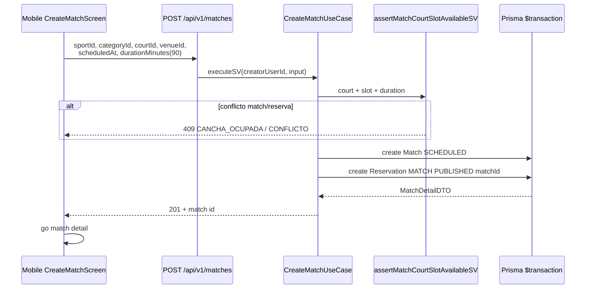
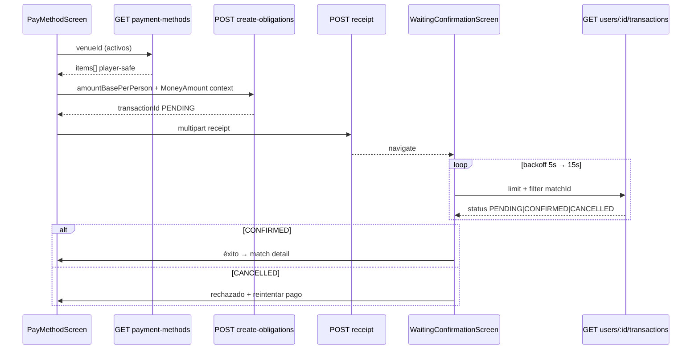
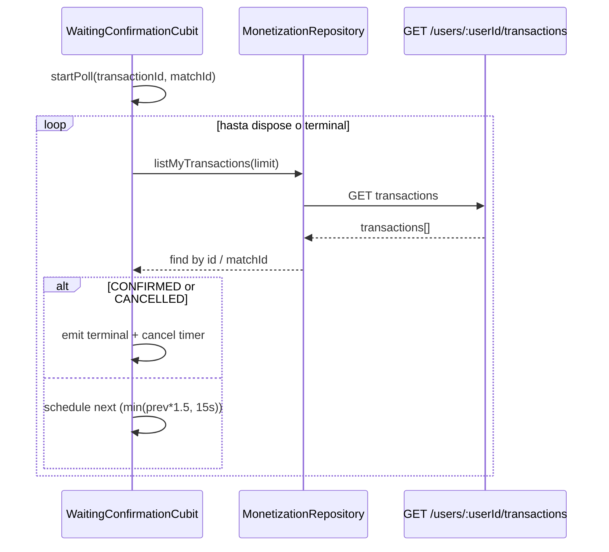
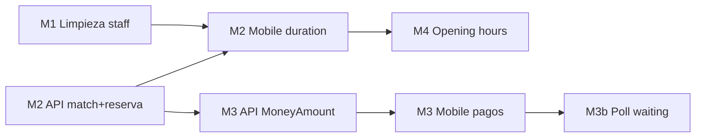

# Design: Mobile jugador-only — alineación pagos, partidas y reservas

## Technical Approach

Alinear `apps/mobile` al rol **jugador** retirando superficie staff (M1), garantizar en **API** que `POST /matches` cree `Match` + `Reservation` `MATCH` `PUBLISHED` en una transacción (M2), consumir pagos con `MoneyAmount` + `GET payment-methods` y polling de estado (M3/M3b), y acotar el picker de disponibilidad con `openingHours` portado a Dart (M4). La web (`apps/web`) y flujos staff permanecen sin cambios; mobile solo **lee** medios de pago y **no** confirma transacciones manualmente.

Referencias de paridad: `apps/web/src/lib/venue-opening-hours.ts`, `services/api/src/domain/services/venue/venue_opening_hours.service.ts`, patrón transaccional existente en `prisma_booking_repository.createBookingSV` (tipo `MATCH`).

---

## Architecture Decisions

| Decisión | Elección | Alternativas rechazadas | Rationale |
|----------|----------|-------------------------|-----------|
| Staff mobile | Eliminación directa (M1) | Ocultar rutas + borrar después | PO bloqueó staff; sin flags ni código muerto |
| Reserva al crear partida | Extender `CreateMatchUseCase` + repo en `$transaction` | Mobile llama `POST /bookings`; deprecar `POST /matches` | Un endpoint para el jugador; consistencia server-side; reutiliza modelo unificado |
| Pagos jugador | `payment-methods` + `MoneyAmount` en summary/transacciones | Solo `payment-info` legacy; híbrido dual-parser | Alineado con multi-moneda archivado; `payment-info` queda deprecado en cliente |
| Horarios picker | Util Dart en `core/venue/` espejo de web/API | Ventana fija 06:00–23:59; depender solo del API sin `openingHours` en cliente | Reduce slots inválidos antes del round-trip; misma semántica que settings web |
| Estado post-comprobante | Poll `GET /users/:userId/transactions` con backoff (M3b) | WebSocket; solo UI estática | Bajo coste; staff confirma en web; `CANCELLED` = rechazado en UX |
| DTO medios de pago | Mapper **player-safe** en presentation API | Exponer `VenuePaymentMethodDTO` completo | Evita `position`/campos staff; mantiene `config` necesario para pagar |
| Conflicto de cancha M2 | Reutilizar `assertMatchCourtSlotAvailableSV` + `findByCourtAndScheduledAt` para reservas `CONFIRMED` no-`MATCH` | Solo checks actuales en `Match` | Staff `DIRECT`/`BLOCKED` debe bloquear slot (paridad `CreateReservationUseCase`) |

---

## Capas y responsabilidades

### Mobile (feature-first + Cubit)

```
lib/src/
  core/
    models/          money_amount.dart, currency_code.dart (existentes)
    venue/           opening_hours.dart (nuevo, M4)
    formatting/      money_format.dart (extendido M3)
  features/
    matches/         create_match: durationMinutes, errores 409, picker M4
    monetization/    payment-methods, MoneyAmount, waiting poll; sin confirm-manual
    venues/          VenueDto.openingHours
  router/            sin /venues/:id/schedule
  core/di/           sin registros backoffice/payments staff
```

**Regla:** presentation → repository → api (Dio). Sin imports de features eliminadas.

### API (Clean Architecture)

```
CreateMatchUseCase (application)
  → assertMatchCourtSlotAvailableSV
  → MatchCrudRepository.createMatchWithReservationSV (nuevo método o adapter)
      $transaction: Match + Reservation(MATCH, PUBLISHED, matchId, durationMinutes)

GetMatchTransactionsSummaryUseCase
  → totales como MoneyAmountDTO + pricingCurrency

Presentation
  → mapPlayerVenuePaymentMethodCON (config tipado, sin campos staff)
```

**No** añadir `*.service.ts` en application; lógica de horarios de reserva ya existe en `assertReservationWithinOpeningHoursSV` — reutilizar en create match cuando hay `venueId` + `scheduledAt`.

---

## Secuencias

### Crear partida + reserva publicada (M2)



### Flujo pago jugador (M3)



### Poll estado transacción (M3b)



---

## Contratos API

### M2 — `POST /api/v1/matches`

**Request** (sin cambio de schema; mobile debe enviar campo ya soportado):

```json
{
  "sportId": "uuid",
  "categoryId": "uuid",
  "type": "REGULAR",
  "scheduledAt": "2026-05-20T14:00:00.000Z",
  "courtId": "uuid",
  "venueId": "uuid",
  "durationMinutes": 90,
  "maxParticipants": 4,
  "pricePerPlayerCents": 1500
}
```

**Response `201`** — `data` = `MatchDetailDTO` existente; opcional ampliar con `reservationId` (recomendado para trazabilidad).

**Errores:** `409 CANCHA_OCUPADA`, `409 HORARIO_RESERVA_INCOMPATIBLE`, `409 CONFLICTO` (reserva staff confirmada solapada), `400` validación `courtId`+`scheduledAt`+`venueId`.

**Comportamiento nuevo:** misma transacción Prisma que `createBookingSV` tipo `MATCH`: `Reservation` con `visibility: PUBLISHED`, `matchId`, `durationMinutes`, `matchStatus: SCHEDULED`, `status: CONFIRMED`.

---

### M3 — `GET /api/v1/venues/:venueId/payment-methods`

**Response `200`:**

```json
{
  "success": true,
  "data": {
    "items": [
      {
        "id": "uuid",
        "type": "BANK_TRANSFER",
        "name": "Transferencia principal",
        "settlementCurrency": "USD",
        "config": {
          "type": "BANK_TRANSFER",
          "accountNumber": "…",
          "bank": "…",
          "idType": "V",
          "idNumber": "…"
        }
      }
    ]
  }
}
```

**Player-safe:** incluir solo métodos `isActive`; **no** exponer `position`, `venueId` opcional en lista; `GET .../payment-methods/all` sigue staff-only (`requireAuth` + staff assert).

---

### M3 — `GET /api/v1/matches/:matchId/transactions/summary`

**Response ampliado** (dual-read temporal):

```json
{
  "success": true,
  "data": {
    "matchId": "uuid",
    "pricingCurrency": "USD",
    "transactionCount": 2,
    "pendingCount": 1,
    "confirmedCount": 1,
    "cancelledCount": 0,
    "totalAmountBase": { "amountMinor": "2000", "currencyCode": "USD" },
    "totalFeeAmount": { "amountMinor": "200", "currencyCode": "USD" },
    "totalAmount": { "amountMinor": "2200", "currencyCode": "USD" },
    "totalAmountBaseCents": "2000",
    "totalFeeAmountCents": "200",
    "totalAmountCents": "2200"
  }
}
```

Legacy `*Cents` string opcional 1 release para clientes antiguos.

---

### M3 — `GET /api/v1/users/:userId/transactions`

Cada ítem debe incluir (si falta, añadir en mapper):

```json
{
  "id": "uuid",
  "matchId": "uuid",
  "status": "PENDING",
  "amountBase": { "amountMinor": "1000", "currencyCode": "USD" },
  "feeAmount": { "amountMinor": "100", "currencyCode": "USD" },
  "amountTotal": { "amountMinor": "1100", "currencyCode": "USD" }
}
```

**Mobile no llama:** `PATCH /transactions/:id/confirm-manual`, endpoints staff de bookings/reservas.

---

## Modelos Dart

| Modelo | Acción | Ubicación |
|--------|--------|-----------|
| `MoneyAmount` | Ya existe; usar en summary/transaction DTOs | `core/models/money_amount.dart` |
| `CurrencyCode` | `resolve(pricingCurrency: venue.pricingCurrency)` en flujos pago | `core/models/currency_code.dart` |
| `MatchTransactionsSummaryDto` | Campos `MoneyAmount?` + fallback legacy strings | `features/monetization/data/models/` |
| `TransactionDto` | `MoneyAmount` para base/fee/total; `status` incluye `CANCELLED` como rechazo | mismo |
| `VenuePaymentMethodDto` | **Crear** player-safe (mover desde backoffice antes de M1 delete, o recrear en M3) | `features/monetization/data/models/venue_payment_method_dto.dart` |
| `VenuePaymentMethodConfig` | Union por `type` para UI de instrucciones | `features/monetization/data/models/` |
| `VenueDto` | `Map<String, dynamic>? openingHours` | `features/venues/data/models/venue_dto.dart` |
| `OpeningHoursMap` + helpers | Port 1:1 de TS | `core/venue/opening_hours.dart` |
| `WaitingConfirmationState` | sealed: polling / confirmed / rejected / error | `features/monetization/presentation/cubit/` |

Eliminar de mobile: `VenuePaymentInfoDto` / `MatchPaymentInfoDto` del flujo feliz (mantener parse opcional 1 release si `getMatchPaymentInfo` falla).

---

## File Changes

### M1 — Eliminar / modificar (mobile)

| Path | Acción |
|------|--------|
| `apps/mobile/lib/src/features/backoffice_reservations/` | **Delete** (carpeta completa) |
| `apps/mobile/lib/src/features/payments/` | **Delete** (carpeta completa) |
| `apps/mobile/test/features/backoffice_reservations/` | **Delete** |
| `apps/mobile/test/features/payments/` | **Delete** |
| `apps/mobile/lib/src/router/app_router.dart` | Quitar import + `GoRoute` `/venues/:venueId/schedule` |
| `apps/mobile/lib/src/router/routes.dart` | Quitar `backofficeSchedule` |
| `apps/mobile/lib/src/core/di/service_locator.dart` | Quitar imports y registros `BackofficeReservations*`, `ReservationPaymentRepository` |

### M2 — API

| Path | Acción |
|------|--------|
| `services/api/src/application/use_cases/create_match.use_case.ts` | Transacción match+reservation; opening hours assert |
| `services/api/src/domain/ports/match_crud_repository.ts` | Método `createMatchWithReservationSV` o extender input |
| `services/api/src/infrastructure/adapters/prisma_match_crud_repository.ts` | Implementación `$transaction` |
| `services/api/src/application/services/assert_match_court_slot_available.ts` | Opcional: overlap reservas CONFIRMED |
| `services/api/src/test/integration/` | Nuevo: create match → reservation PUBLISHED visible en bookings; 409 |

### M2 — Mobile

| Path | Acción |
|------|--------|
| `apps/mobile/lib/src/features/matches/presentation/create_match_screen.dart` | `durationMinutes: 90` en create + availability |
| `apps/mobile/lib/src/features/matches/data/matches_repository.dart` | Ya soporta `durationMinutes` — usar desde UI |

### M3 — API

| Path | Acción |
|------|--------|
| `services/api/src/application/use_cases/get_match_transactions_summary.use_case.ts` | `MoneyAmountDTO` + `pricingCurrency` |
| `services/api/src/application/use_cases/list_user_transactions.use_case.ts` | Money en ítems |
| `services/api/src/presentation/controllers/monetization.controller.ts` | Mappers respuesta |
| `services/api/src/presentation/controllers/venue_payment_methods.controller.ts` | `mapPlayerVenuePaymentMethod` |
| `services/api/src/presentation/mappers/` (nuevo si no existe) | Player-safe payment method |
| `services/api/src/test/unit/` + `integration/monetization*.ts` | Contratos MoneyAmount |

### M3 — Mobile

| Path | Acción |
|------|--------|
| `apps/mobile/lib/src/features/monetization/data/monetization_api.dart` | `getVenuePaymentMethods`; quitar `confirmTransactionManual` |
| `apps/mobile/lib/src/features/monetization/data/monetization_repository.dart` | Idem + `listVenuePaymentMethods` |
| `apps/mobile/lib/src/features/monetization/presentation/pay_method_screen.dart` | payment-methods + `formatMoney` |
| `apps/mobile/lib/src/features/monetization/presentation/waiting_confirmation_screen.dart` | Stateful + Cubit poll |
| `apps/mobile/lib/src/features/monetization/presentation/cubit/waiting_confirmation_cubit.dart` | **Create** |
| DTOs monetization | Ver tabla modelos |

### M4 — Mobile

| Path | Acción |
|------|--------|
| `apps/mobile/lib/src/core/venue/opening_hours.dart` | **Create** |
| `apps/mobile/test/core/venue/opening_hours_test.dart` | **Create** |
| `apps/mobile/lib/src/features/venues/data/models/venue_dto.dart` | `openingHours` |
| `apps/mobile/lib/src/features/matches/presentation/create_match_screen.dart` | `_availabilityFromUtc`/`_to` desde opening hours + TZ `America/Caracas` |

---

## Plan chained PRs

| PR | Scope | Depende de | Verificación |
|----|-------|------------|--------------|
| **PR1 — M1** | Delete staff features + router/DI | — | `flutter analyze`, `flutter test`, grep sin `backoffice_reservations` |
| **PR2 — M2 API** | CreateMatch + Reservation PUBLISHED | PR1 opcional | `npm run typecheck`, `npm test` integration |
| **PR3 — M2 mobile** | `durationMinutes` en create/availability | PR2 desplegado o branch API | widget test create match 409 |
| **PR4 — M3 API** | MoneyAmount summary/transactions + player payment mapper | PR2 | vitest monetization |
| **PR5 — M3 mobile** | payment-methods, sin confirm-manual, MoneyAmount UI | PR4 | `money_format_test`, cubit monetization |
| **PR6 — M3b mobile** | WaitingConfirmationCubit poll | PR5 | bloc_test estados terminal |
| **PR7 — M4 mobile** | opening_hours + picker | PR3 (venue detail con hours) | unit `opening_hours_test` |

**Presupuesto:** cada PR mobile ≤ ~400 líneas; API M2/M3 pueden ir en un solo PR si < 400 líneas combinadas.

`Decision needed before apply: Yes` (cadena obligatoria)  
`Chained PRs recommended: Yes`  
`400-line budget risk: Medium` (M1 ~27 archivos pero muchos deletes)

---

## Eliminaciones M1 — lista exacta

### Carpetas a borrar

- `apps/mobile/lib/src/features/backoffice_reservations/`
- `apps/mobile/lib/src/features/payments/`
- `apps/mobile/test/features/backoffice_reservations/`
- `apps/mobile/test/features/payments/`

### Archivos bajo `backoffice_reservations/` (19)

- `data/backoffice_reservations_api.dart`
- `data/backoffice_reservations_repository.dart`
- `data/backoffice_reservations_repository_interface.dart`
- `data/reservation_payment_repository.dart`
- `data/models/booking_item.dart`
- `data/models/reservation_dto.dart`
- `data/models/reservation_payment_summary_dto.dart`
- `data/models/venue_payment_method_dto.dart`
- `presentation/backoffice_schedule_screen.dart`
- `presentation/cubit/backoffice_reservations_cubit.dart`
- `presentation/cubit/backoffice_reservations_state.dart`
- `presentation/widgets/booking_detail_sheet.dart`
- `presentation/widgets/booking_payment_sheet.dart`
- `presentation/widgets/reservation_modal.dart`
- `presentation/widgets/weekly_calendar.dart`
- `test/.../backoffice_reservations_cubit_test.dart`
- `test/.../booking_item_test.dart`
- `test/.../backoffice_reservations_repository_test.dart`
- `test/.../reservation_payment_summary_dto_test.dart`

### Archivos bajo `payments/` (8)

- `data/payments_api.dart`
- `data/payments_repository.dart`
- `data/models/pending_transaction_dto.dart`
- `presentation/payments_screen.dart`
- `presentation/cubit/payments_cubit.dart`
- `presentation/cubit/payments_state.dart`
- `presentation/widgets/payment_list_tile.dart`
- `test/.../payments_cubit_test.dart`

### Modificados (no borrar)

- `apps/mobile/lib/src/router/app_router.dart`
- `apps/mobile/lib/src/router/routes.dart`
- `apps/mobile/lib/src/core/di/service_locator.dart`

---

## Testing Strategy

| Fase | API (Vitest) | Mobile (flutter_test / bloc_test) |
|------|----------------|-------------------------------------|
| **M1** | — | Sin tests en carpetas borradas; CI completo verde |
| **M2** | Integration: POST match crea `Reservation` `MATCH` `PUBLISHED`; GET bookings staff muestra bloqueo; 409 cancha ocupada | `create_match` envía `durationMinutes`; failure dialog en 409 |
| **M3** | Unit mapper MoneyAmount; integration summary con `currencyCode`; GET payment-methods solo activos | `money_format_test`; `MatchTransactionsSummaryDto` parse; repository sin `confirmTransactionManual`; `PayMethodScreen` widget smoke |
| **M3b** | — | `WaitingConfirmationCubit`: PENDING → CONFIRMED; PENDING → CANCELLED; cancel on dispose |
| **M4** | — (lógica ya en `venue_opening_hours.service.test.ts`) | `opening_hours_test`: domingo cerrado, rango válido, `validateTimeWithinDayHours` |

Orden CI: API `typecheck` → `lint` → `test`; mobile `flutter analyze` → `flutter test`.

---

## Migration / Rollout

| Mecanismo | Uso |
|-----------|-----|
| **Feature flag API** | `MATCH_CREATE_LINKED_RESERVATION=false` revierte solo creación de reserva (match sigue creándose) — implementar si deploy gradual |
| **Dual-read MoneyAmount** | Summary expone objeto + strings `*Cents` una release |
| **Deprecación `payment-info`** | Mobile deja de llamarlo en flujo feliz; endpoint API sin borrar |
| **Rollback M1** | `git revert` PR1 |
| **Rollback M2 API** | Revert + script opcional cancelar reservas `MATCH` huérfanas (`matchId` set, partido cancelado) |
| **Rollback mobile M3/M4** | Revert build; API backward-compatible |

No feature flag en mobile (eliminación staff es decisión de producto).

---

## Open Questions

- [ ] ¿Exponer `reservationId` en `MatchDetailDTO` para deep links web/mobile?
- [ ] ¿Unificar `findConflictingActiveMatchIdSV` con overlap de reservas `DIRECT`/`BLOCKED` en availability endpoint (fuera de M2)?
- [ ] Timezone sede: ¿campo `venue.timezone` en API o constante `America/Caracas` hasta settings mobile no existan?

---

## Diagrama de dependencias entre fases


