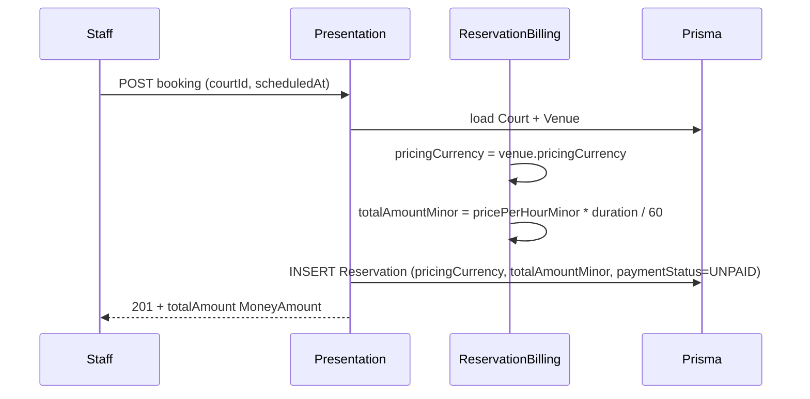
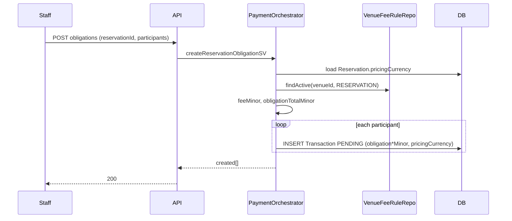
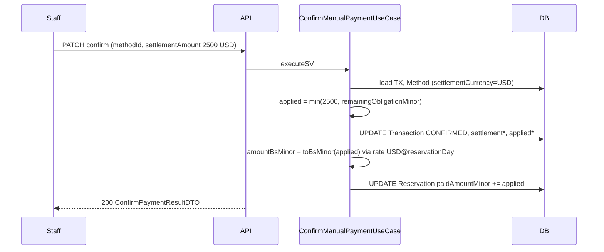
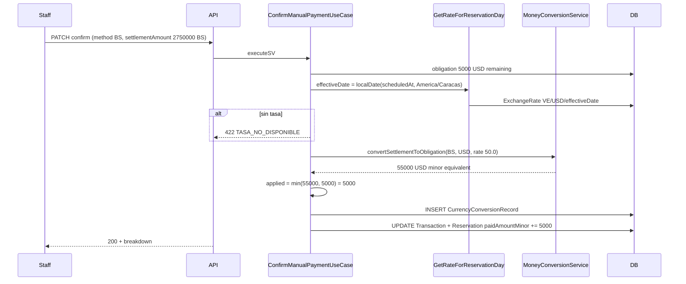

# Design: Modelo financiero multi-moneda (multi-currency-payments)

| Campo | Valor |
|-------|-------|
| **Change** | `multi-currency-payments` |
| **Propuesta** | [`proposal.md`](./proposal.md) |
| **Spec** | [`spec.md`](./spec.md) |
| **Migraciones** | [`migrations.md`](./migrations.md) |
| **Modelo contable** | **Modelo C híbrido** (comercial / liquidación / reporting VE) |

## Technical Approach

Implementar el **Modelo C** en tres capas monetarias sin violar Clean Architecture: (1) obligación y pricing en `pricingCurrency` de la sede, (2) liquidación en `settlementCurrency` del medio de pago, (3) reporting VE vía `amountBsMinor` + `CurrencyConversionRecord` con tasa del **día de la reserva** (`REQ-MCP-018`, `REQ-MCP-019`). El enfoque es **schema-first** con migraciones backward-compatible, **domain `MoneyAmount` puro**, orquestación en application mediante casos de uso + `PaymentOrchestrator` delgado, e implementación Prisma/mappers solo en infrastructure. La confirmación manual existente (`ConfirmTransactionAsVenueStaffUseCase`, `updateReservationPaymentFromTransactionRepo`) se refactoriza para dejar de sumar `amountTotal` × 100 (`REQ-MCP-036`, `REQ-MCP-026`).

---

## 1. Architecture overview — Modelo C (tres capas)

```text
┌─────────────────────────────────────────────────────────────────┐
│ CAPA COMERCIAL (obligación / pricing)                           │
│ Venue.pricingCurrency → Reservation.pricingCurrency              │
│ totalAmountMinor, obligation* en Transaction                    │
│ paidAmountMinor agregado SOLO en pricingCurrency                │
└────────────────────────────┬────────────────────────────────────┘
                             │ conversión vía MoneyConversionService
                             │ + tasa ExchangeRate(effectiveDate)
┌────────────────────────────▼────────────────────────────────────┐
│ CAPA LIQUIDACIÓN (pago real)                                    │
│ VenuePaymentMethod.settlementCurrency                             │
│ Transaction.settlementAmountMinor, venuePaymentMethodId         │
└────────────────────────────┬────────────────────────────────────┘
                             │ snapshot inmutable
┌────────────────────────────▼────────────────────────────────────┐
│ CAPA REPORTING VE (derivada)                                    │
│ CurrencyConversionRecord + Transaction.amountBsMinor            │
│ (Fase 2: Reservation.paidAmountBsMinor, ReservationPaymentLedger)│
└─────────────────────────────────────────────────────────────────┘
```

| Capa | Fuente de verdad | Consumidores |
|------|------------------|--------------|
| Comercial | `Reservation.pricingCurrency`, `*Minor` en pricing | UI staff/jugador, `paymentStatus` |
| Liquidación | `VenuePaymentMethod.settlementCurrency`, `settlementAmountMinor` | Conciliación bancaria, comprobantes |
| Reporting VE | `amountBsMinor`, `CurrencyConversionRecord.rateToBs` | Dashboard platform (Fase 2), auditoría |

**Regla de agregación (REQ-MCP-NFR-001):** nunca `SUM(amountMinor)` cross-currency; platform MAY sumar `amountBsMinor` solo en Fase 2.

---

## 2. Domain layer

### 2.1 Value objects y enums

**Archivos nuevos:**

| Archivo | Contenido |
|---------|-----------|
| `src/domain/money/currency_code.ts` | `enum CurrencyCode { BS, USD, EUR }` + `isCurrencyCode()` |
| `src/domain/money/money_amount.ts` | `MoneyAmount { amountMinor: bigint; currencyCode: CurrencyCode }` |
| `src/domain/money/money_amount_ops.ts` | `addMoneySV`, `subtractMoneySV`, `minMoneySV`, `compareMoneySV` — solo misma currency |
| `src/domain/money/exchange_rate_snapshot.ts` | `{ id?, countryCode, currency, rateToBs, effectiveDate, source }` |

```typescript
// currency_code.ts — sin imports externos
export enum CurrencyCode {
  BS = 'BS',
  USD = 'USD',
  EUR = 'EUR',
}

export type MoneyAmount = {
  readonly amountMinor: bigint;
  readonly currencyCode: CurrencyCode;
};
```

### 2.2 Domain errors

**Archivo:** `src/domain/money/money_errors.ts`

| Error | Código HTTP (presentation) | REQ |
|-------|---------------------------|-----|
| `CurrencyMismatchError` | 422 `MONEDA_INCOMPATIBLE` | REQ-MCP-003, REQ-MCP-012 |
| `InvalidMoneyAmountError` | 400 `MONTO_INVALIDO` | REQ-MCP-005, REQ-MCP-006 |
| `CrossCurrencyArithmeticError` | 500 / dominio | REQ-MCP-NFR-001 |
| `ExchangeRateNotFoundError` | 422 `TASA_NO_DISPONIBLE` | REQ-MCP-019 |
| `OverpaymentNotAllowedError` | 422 `SOBREPAGO_NO_PERMITIDO` | REQ-MCP-027 |
| `TransactionAlreadyConfirmedError` | 409 `TRANSACCION_YA_CONFIRMADA` | REQ-MCP-040 |

Errores extienden `AppError` existente o wrapper en domain; presentation mapea a HTTP.

### 2.3 Ports (interfaces) — solo en domain

| Port | Archivo | Responsabilidad |
|------|---------|-----------------|
| `MoneyConversionService` | `src/domain/ports/money_conversion_service.ts` | Conversión y BS snapshot; **sin** Prisma |
| `ExchangeRateRepository` | extender `exchange_rate_repository.ts` | `findByCountryCurrencyAndDateSV` |
| `VenueFeeRuleRepository` | `src/domain/ports/venue_fee_rule_repository.ts` | Regla activa por `venueId` + `scope` |

```typescript
// money_conversion_service.ts — interface only
export interface MoneyConversionService {
  /** Convierte amount a toCurrency usando rate (1 unit currency = rateToBs BS). */
  convertSV(
    _amount: MoneyAmount,
    _toCurrency: CurrencyCode,
    _rate: ExchangeRateSnapshot,
  ): MoneyAmount;

  /** Equivalente BS minor del monto (para reporting). */
  toBsMinorSV(_amount: MoneyAmount, _rate: ExchangeRateSnapshot): bigint;

  /** BS → pricing/obligation o pricing → BS según pares MVP (vía BS pivot). */
  convertSettlementToObligationSV(
    _settlement: MoneyAmount,
    _obligationCurrency: CurrencyCode,
    _rate: ExchangeRateSnapshot,
  ): MoneyAmount;
}
```

**Redondeo (REQ-MCP-NFR-002):** half-up a entero minor en infrastructure (`Prisma.Decimal` + `ROUND_HALF_UP`); domain documenta contrato, no implementa float.

### 2.4 Fee en domain

Extender `computeFeeAmountSV` → `computeFeeMinorSV(_baseMinor: bigint, _rule, _currencyCode)` en `src/domain/monetization/fee_calculation.ts`; PERCENTAGE usa `bigint` + redondeo half-up; FIXED interpreta `value` como minor (`REQ-MCP-031`, `REQ-MCP-032`).

---

## 3. Application layer

### 3.1 Orquestación: `PaymentOrchestrator` + use cases

**Decisión:** mantener use cases atómicos (patrón existente) y añadir `PaymentOrchestrator` como **facade** de application que coordina repos + `MoneyConversionService` + transacción Prisma. No sustituye controllers.

**Archivo:** `src/application/payment/payment_orchestrator.ts`

| Método | Use case delegado | REQ |
|--------|-------------------|-----|
| `createReservationObligationSV` | `CreateReservationObligationUseCase` | REQ-MCP-034, REQ-MCP-041 |
| `confirmManualPaymentSV` | `ConfirmManualPaymentUseCase` | REQ-MCP-037, REQ-MCP-039 |
| `syncReservationPaymentSV` | `SyncReservationPaymentUseCase` | REQ-MCP-023, REQ-MCP-024 |
| `getRateForReservationDaySV` | `GetRateForReservationDayUseCase` | REQ-MCP-017, REQ-MCP-018 |

### 3.2 Use cases (nuevos / refactor)

| Use case | Input DTO | Output DTO | Notas |
|----------|-----------|------------|-------|
| `CreateReservationObligationUseCase` | `{ reservationId, amountBasePerPersonMinor?, participantUserIds? }` | `{ created[], skipped[] }` | Congela `pricingCurrency`; aplica `VenueFeeRule` |
| `ConfirmManualPaymentUseCase` | `{ transactionId, actorUserId, venuePaymentMethodId, settlementAmount: MoneyAmount, referenceNumber? }` | `ConfirmPaymentResultDTO` | Reemplaza lógica Prisma directa en `ConfirmTransactionAsVenueStaffUseCase` |
| `SyncReservationPaymentUseCase` | `{ reservationId }` | `{ totalAmount, paidAmount, paymentStatus }` | Suma `appliedToObligationMinor` confirmados |
| `GetRateForReservationDayUseCase` | `{ reservationId }` o `{ venueId, scheduledAt }` | `ExchangeRateSnapshot` | TZ desde `VenueMonetizationSettings` |

**`ConfirmManualPaymentUseCase` flujo interno:**

1. Cargar TX + Reservation + Venue + Method (ports).
2. Autorizar staff (`VenueStaffRepository`) — igual que hoy.
3. Validar `settlementAmount.currencyCode === method.settlementCurrency` (`REQ-MCP-012`).
4. `rate = getRateForReservationDaySV` si cross-currency o si `amountBsMinor` requerido.
5. Calcular `appliedToObligationMinor` (cap pendiente; overpayment check `REQ-MCP-027`).
6. En `$transaction`: update TX, opcional `CurrencyConversionRecord`, `syncReservationPaymentSV`.
7. Dual-write legacy `amountBase`/`amountTotal` si flag activo (`REQ-MCP-NFR-005`).

**DTOs:** `src/application/dto/money.dto.ts`, `src/application/dto/confirm_payment_result.dto.ts`

```typescript
export type MoneyAmountDTO = {
  amountMinor: string; // bigint serializado
  currencyCode: CurrencyCode;
};

export type ConfirmPaymentResultDTO = {
  transactionId: string;
  status: 'CONFIRMED';
  confirmedAt: string;
  settlementAmount: MoneyAmountDTO;
  appliedToObligation: MoneyAmountDTO;
  reservationPayment?: {
    paidAmount: MoneyAmountDTO;
    totalAmount: MoneyAmountDTO;
    paymentStatus: 'UNPAID' | 'PARTIAL' | 'PAID';
  };
};
```

### 3.3 Refactor AS-IS

| Archivo AS-IS | Acción |
|---------------|--------|
| `monetization.service.ts` | Delegar confirmación/reserva a orchestrator; deprecar `convertAmountToBsSV` público → usar port |
| `confirm_transaction_as_venue_staff.use_case.ts` | Inyectar `ConfirmManualPaymentUseCase`; eliminar `_prisma.transaction.update` directo |
| `transaction.repository.ts` | `updateReservationPaymentFromTransactionRepo` usa suma de `appliedToObligationMinor` |

### 3.4 Dependency injection (application)

Use cases reciben por constructor **solo interfaces** de `src/domain/ports/` + DTOs. Ningún import de `generated/prisma` ni repos concretos en application (corregir violación actual en `ConfirmTransactionAsVenueStaffUseCase` que importa repos de infrastructure).

---

## 4. Infrastructure

### 4.1 Prisma schema delta (resumen)

Detalle SQL y orden en [`migrations.md`](./migrations.md).

| Modelo / enum | Campos nuevos / cambio |
|---------------|----------------------|
| `CurrencyCode` | enum `BS`, `USD`, `EUR` |
| `Venue` | `countryCode String @default("VE")`; `pricingCurrency CurrencyCode` (migrate desde `displayCurrency`) |
| `VenueMonetizationSettings` | `venueId` PK, `timezone`, `allowOverpayment`, `overpaymentToleranceMinor` |
| `VenuePaymentMethod` | `settlementCurrency CurrencyCode` |
| `Reservation` | `pricingCurrency`, `totalAmountMinor BigInt?`, `paidAmountMinor BigInt @default(0)`; Fase 2: `paidAmountBsMinor` |
| `VenueFeeRule` | `venueId`, `scope`, `type`, `value`, `currencyCode`, `isActive`, timestamps |
| `ExchangeRate` | `effectiveDate Date @db.Date`; unique `(countryCode, currency, effectiveDate)` |
| `CurrencyConversionRecord` | ver §4.3 |
| `Transaction` | `obligationCurrency`, `obligationAmountMinor`, `feeAmountMinor`, `obligationTotalMinor`, `pricingCurrency`, `settlementCurrency?`, `settlementAmountMinor?`, `appliedToObligationMinor?`, `amountBsMinor?`, `needsReview Boolean @default(false)` |
| `ReservationPaymentLedger` | **Fase 2** — no crear en migración P0 |

**Compat:** mantener `displayCurrency`, `totalAmountCents`, `paidAmountCents`, `amountBase`/`amountTotal` Decimal durante dual-write.

### 4.2 Mappers

| Mapper | Archivo |
|--------|---------|
| `Transaction` ↔ dominio | `src/infrastructure/mappers/transaction_money.mapper.ts` |
| `Reservation` money fields | `src/infrastructure/mappers/reservation_money.mapper.ts` |
| `ExchangeRate` → `ExchangeRateSnapshot` | extender mapper existente |
| Prisma `CurrencyCode` ↔ domain | `currency_code.mapper.ts` |

### 4.3 `CurrencyConversionRecord` (Prisma)

| Campo | Tipo |
|-------|------|
| `id` | UUID PK |
| `transactionId` | FK unique (1:1 por TX en MVP) |
| `fromCurrency` | `CurrencyCode` |
| `toCurrency` | `CurrencyCode` |
| `fromAmountMinor` | `BigInt` |
| `toAmountMinor` | `BigInt` |
| `rateToBs` | `Decimal(14,4)` |
| `rateDate` | `Date @db.Date` |
| `exchangeRateId` | FK optional |
| `source` | `String?` |
| `createdAt` | `DateTime` |

### 4.4 Repositories

| Repository | Archivo | Cambios |
|------------|---------|---------|
| `PrismaExchangeRateRepository` | implementa port extendido | `findByCountryCurrencyAndDateSV` |
| `PrismaCurrencyConversionRecordRepository` | nuevo | `createSV` solo insert |
| `PrismaVenueFeeRuleRepository` | nuevo | `findActiveForVenueAndScopeSV` |
| `transaction.repository.ts` | modificar | create/confirm con minors; agregación |
| `PrismaMoneyConversionService` | `src/infrastructure/services/prisma_money_conversion.service.ts` | implementa `MoneyConversionService` |

### 4.5 Feature flag

`src/infrastructure/config/feature_flags.ts`: `MULTI_CURRENCY_PAYMENTS` (env, default `false` en prod hasta cutover). Repositories consultan flag para dual-read/write (`REQ-MCP-NFR-007`).

---

## 5. Presentation

### 5.1 Zod

**`monetization.validation.ts`:**

```typescript
export const CURRENCY_CODE_SCHEMA = z.enum(['BS', 'USD', 'EUR']);
export const MONEY_AMOUNT_SCHEMA = z.object({
  amountMinor: z.union([
    z.string().regex(/^\d+$/),
    z.number().int().nonnegative(),
  ]).transform(String),
  currencyCode: CURRENCY_CODE_SCHEMA,
});
export const CONFIRM_TRANSACTION_BODY_SCHEMA = z.object({
  venuePaymentMethodId: optionalPaymentMethodIdField(),
  settlementAmount: MONEY_AMOUNT_SCHEMA,
  referenceNumber: z.string().max(200).optional(),
  paymentData: z.record(z.string(), z.unknown()).optional(),
}).strict();
```

### 5.2 Controllers / routers

| Endpoint | Controller | Cambio |
|----------|------------|--------|
| `PATCH .../transactions/:id/confirm-manual` | `monetization.controller.ts` | Body con `settlementAmount` |
| `PATCH .../venue-staff/.../confirm` | `venue_staff.controller.ts` | Misma validación |
| `GET .../reservations/:id/payments` | monetization | Respuesta `MoneyAmount` |
| Venue settings | venue controller | `pricingCurrency`, monetization settings CRUD |
| Payment methods | venue payment methods | `settlementCurrency` en create/update |

### 5.3 Composition root

**`venue_staff.composition.ts`** (wiring nuevo):

```typescript
const EXCHANGE_RATE_REPO = new PrismaExchangeRateRepository();
const MONEY_CONVERSION = new PrismaMoneyConversionService();
const CONFIRM_MANUAL_UC = new ConfirmManualPaymentUseCase(
  VENUE_STAFF_REPO,
  TRANSACTION_REPO_PORT,
  EXCHANGE_RATE_REPO,
  MONEY_CONVERSION,
  VENUE_MONETIZATION_REPO,
);
export const CONFIRM_TRANSACTION_AS_VENUE_STAFF_UC =
  new ConfirmTransactionAsVenueStaffUseCase(CONFIRM_MANUAL_UC);
```

**Nuevo:** `src/presentation/composition/monetization.composition.ts` para `PaymentOrchestrator` y obligaciones.

**`monetization.router.ts`:** sin cambio de rutas; sí de handlers.

---

## 6. Sequence diagrams

### 6.1 Crear reserva (booking)



### 6.2 Crear obligación



### 6.3 Confirmar misma moneda (USD venue, USD method)



### 6.4 Confirmar cross-currency (BS payment, USD venue)



---

## 7. Golden examples (tests unitarios)

Fórmulas (MVP, pivot BS, `rateToBs` = unidades BS por 1 unidad foreign):

| Paso | Fórmula |
|------|---------|
| BS → USD | `usdMinor = round(bsMinor / rateToBs)` half-up |
| USD → BS | `bsMinor = round(usdMinor * rateToBs)` |
| Cap obligación | `applied = min(converted, remainingObligationMinor)` |

### Caso A — Cross-currency (REQ-MCP-025, REQ-MCP-039)

| Campo | Valor |
|-------|-------|
| `pricingCurrency` / obligation | USD |
| `remainingObligationMinor` | `5000` (= $50.00) |
| `settlementAmountMinor` | `2750000` BS (= Bs 27.500,00) |
| `rateToBs` | `50.0` |
| `effectiveDate` | día de `scheduledAt` en `America/Caracas` |

| Resultado esperado | Valor |
|--------------------|-------|
| USD equivalente bruto | `round(2750000 / 50) = 55000` minor |
| `appliedToObligationMinor` | `5000` (cap) |
| `amountBsMinor` (applied) | `round(5000 * 50) = 250000` |
| `paidAmountMinor` delta | `+5000` USD |
| `paymentStatus` | `PAID` si `totalAmountMinor = 5000` |

### Caso B — Misma moneda parcial (REQ-MCP-038)

| Campo | Valor |
|-------|-------|
| Obligation remaining | `5000` USD |
| Settlement | `2500` USD |
| `appliedToObligationMinor` | `2500` |
| `CurrencyConversionRecord` | omitido (sin cross-currency) |
| `amountBsMinor` | `125000` (2500 × 50) |
| `paymentStatus` | `PARTIAL` si total `5000` |

### Caso C — Sin tasa (REQ-MCP-019)

| Campo | Valor |
|-------|-------|
| `ExchangeRate` para effectiveDate | no existe |
| HTTP | `422` `TASA_NO_DISPONIBLE` |

### Caso D — Fee 10% (REQ-MCP-031)

| Campo | Valor |
|-------|-------|
| `totalAmountMinor` | `850000` USD |
| Fee 10% | `85000` |
| `obligationTotalMinor` | `935000` |

**Archivo test:** `src/test/unit/money_conversion.golden.test.ts`

---

## 8. Web y mobile

### 8.1 Web (`apps/web`)

| Artefacto | Acción |
|-----------|--------|
| `src/lib/money.ts` | **Crear** `formatMoney(minor, currencyCode)`, `parseMoneyInput(major, code)` |
| `src/types/api.ts` | **Modificar** `MoneyAmount`, `pricingCurrency` en Reservation, `settlementCurrency` en VenuePaymentMethod |
| `src/lib/api-client.ts` | Tipos confirmación con `settlementAmount` |
| `ReservationDetailModal.tsx` | Reemplazar `$` y `/100` fijo por `formatMoney`; enviar `settlementAmount` en confirm (`REQ-MCP-046`, `REQ-MCP-047`) |
| `PaymentMethodsSettings.tsx` | Selector `settlementCurrency` (`REQ-MCP-048`) |
| `src/lib/money.test.ts` | Vitest golden display |

### 8.2 Mobile (`apps/mobile`) — Fase 1 lectura

| Artefacto | Fase |
|-----------|------|
| `lib/src/core/money/money_formatter.dart` | 1 — `formatMoney` |
| Modelos API reserva/transacción | 1 — parse `MoneyAmount` |
| Pantallas detalle reserva | 1 — mostrar moneda correcta |
| Confirmación staff | **2** — paridad con web |

---

## 9. Migration plan (resumen)

Plan detallado en [`migrations.md`](./migrations.md).

| Fase | Acción |
|------|--------|
| M1 | Add nullable columns + enums + tablas nuevas |
| M2 | Backfill (`pricingCurrency`, `*Minor`, `settlementCurrency`) |
| M3 | Dual-write en application (`REQ-MCP-NFR-005`) |
| M4 | Cutover lectura `MoneyAmount` + flag `MULTI_CURRENCY_PAYMENTS=true` |
| M5 (Fase 2) | Drop legacy columns |

**Rollback:** flag off → lectura legacy; DB forward-only con columnas legacy intactas.

---

## 10. Chained PR plan (≤400 líneas cada uno)

| PR | Rama sugerida | Contenido | REQ principales |
|----|---------------|-----------|-----------------|
| **PR1** | `mcp/01-schema-domain` | Prisma migrations, seed `ExchangeRate` por fecha, domain `MoneyAmount`, ports, golden tests conversión | 001–006, 017 |
| **PR2** | `mcp/02-confirm-aggregation` | Transaction/Reservation fields, repos, `ConfirmManualPaymentUseCase`, `SyncReservationPayment`, flag | 023–026, 034–040 |
| **PR3** | `mcp/03-venue-settings` | `VenueMonetizationSettings`, `VenueFeeRule`, payment methods `settlementCurrency`, APIs settings | 007–016, 029–033 |
| **PR4** | `mcp/04-web-ui` | `formatMoney`, modal, PaymentMethodsSettings, api types/tests | 045–051 |
| **PR5** | `mcp/05-mobile-ledger` | Mobile lectura; **Fase 2:** ledger + `paidAmountBsMinor` | 052–057 |

---

## 11. File change manifest

| File | Action | Description |
|------|--------|-------------|
| `services/api/prisma/schema.prisma` | Modify | Enums, modelos, campos §4.1 |
| `services/api/prisma/migrations/*.sql` | Create | Ver migrations.md |
| `services/api/prisma/seed.ts` | Modify | Tasas por `effectiveDate`, venue monetization |
| `services/api/src/domain/money/*` | Create | VO, errors, ops |
| `services/api/src/domain/ports/money_conversion_service.ts` | Create | Port conversión |
| `services/api/src/domain/ports/venue_fee_rule_repository.ts` | Create | Port fees |
| `services/api/src/domain/ports/exchange_rate_repository.ts` | Modify | Lookup por fecha |
| `services/api/src/domain/monetization/fee_calculation.ts` | Modify | Fee en minor |
| `services/api/src/application/payment/payment_orchestrator.ts` | Create | Facade |
| `services/api/src/application/use_cases/confirm_manual_payment.use_case.ts` | Create | Confirmación multi-moneda |
| `services/api/src/application/use_cases/create_reservation_obligation.use_case.ts` | Create | Obligaciones |
| `services/api/src/application/use_cases/sync_reservation_payment.use_case.ts` | Create | Agregación |
| `services/api/src/application/use_cases/get_rate_for_reservation_day.use_case.ts` | Create | Tasa día reserva |
| `services/api/src/application/use_cases/confirm_transaction_as_venue_staff.use_case.ts` | Modify | Delegar; quitar Prisma directo |
| `services/api/src/application/monetization.service.ts` | Modify | Delegar orchestrator |
| `services/api/src/application/dto/money.dto.ts` | Create | DTOs |
| `services/api/src/infrastructure/services/prisma_money_conversion.service.ts` | Create | Impl conversión |
| `services/api/src/infrastructure/mappers/*_money.mapper.ts` | Create | Mappers |
| `services/api/src/infrastructure/repositories/exchange_rate.repository.ts` | Modify | effectiveDate |
| `services/api/src/infrastructure/repositories/currency_conversion_record.repository.ts` | Create | Auditoría |
| `services/api/src/infrastructure/repositories/venue_fee_rule.repository.ts` | Create | Fees por sede |
| `services/api/src/infrastructure/repositories/transaction.repository.ts` | Modify | Minors + agregación |
| `services/api/src/presentation/validation/monetization.validation.ts` | Modify | `MONEY_AMOUNT_SCHEMA` |
| `services/api/src/presentation/composition/monetization.composition.ts` | Create | DI monetización |
| `services/api/src/presentation/composition/venue_staff.composition.ts` | Modify | Wire confirm UC |
| `services/api/src/presentation/controllers/monetization.controller.ts` | Modify | Respuestas MoneyAmount |
| `services/api/src/presentation/controllers/venue_staff.controller.ts` | Modify | Confirm body |
| `services/api/src/test/unit/money_conversion.golden.test.ts` | Create | Golden §7 |
| `services/api/src/test/unit/monetization.validation.test.ts` | Modify | Schema settlementAmount |
| `apps/web/src/lib/money.ts` | Create | formatMoney |
| `apps/web/src/lib/money.test.ts` | Create | Tests |
| `apps/web/src/types/api.ts` | Modify | MoneyAmount types |
| `apps/web/src/lib/api-client.ts` | Modify | Confirm payload |
| `apps/web/src/components/schedule/ReservationDetailModal.tsx` | Modify | UI multi-moneda |
| `apps/web/src/components/settings/PaymentMethodsSettings.tsx` | Modify | settlementCurrency |
| `apps/mobile/lib/src/core/money/money_formatter.dart` | Create (Fase 1) | Formato |
| `openspec/changes/multi-currency-payments/design.md` | Create | Este documento |
| `openspec/changes/multi-currency-payments/migrations.md` | Create | Plan Prisma |

---

## 12. Phase 1 vs Phase 2 — boundary

### Phase 1 (MVP — construir)

- `CurrencyCode`, `MoneyAmount`, conversión, confirmación manual cross-currency
- `Venue.pricingCurrency`, `VenuePaymentMethod.settlementCurrency`
- `VenueMonetizationSettings`, `VenueFeeRule`
- `ExchangeRate.effectiveDate`, `CurrencyConversionRecord`
- `Reservation`/`Transaction` minors + agregación `paidAmountMinor`
- Web: `formatMoney`, modal, payment methods
- Migración backfill + dual-write + feature flag
- Tests golden + contract + integración confirmación

### Phase 2 (NO construir en Phase 1)

| Item | REQ |
|------|-----|
| `ReservationPaymentLedger` + `LedgerService` única escritura | REQ-MCP-052–057, REQ-MCP-NFR-006 |
| `Reservation.paidAmountBsMinor` agregado | REQ-MCP-028 |
| Job conciliación diaria / cola excepciones | proposal Phase 2 |
| Mobile confirmación staff completa | REQ-MCP-050 (extensión) |
| Drop columnas `*Cents`, `amountBase`/`amountTotal` | cleanup migration |
| Reembolsos / asientos compensatorios UI | out of scope |
| PSP / webhooks | Phase 3 producto |

---

## 13. Clean Architecture alignment

| Regla | Cumplimiento |
|-------|--------------|
| Domain sin Prisma/frameworks | `MoneyAmount`, ports, errores en `src/domain/` |
| Application solo importa domain | Use cases con DI de ports; **refactor** para eliminar imports directos a `infrastructure/repositories` en UC existentes |
| Infrastructure implementa ports + mappers | `PrismaMoneyConversionService`, repos, mappers Transaction↔domain |
| Presentation = composition root | `*.composition.ts` instancia adaptadores concretos |
| No Prisma en application/domain | `ConfirmTransactionAsVenueStaffUseCase` deja de recibir `PrismaClient` |

```text
Presentation → Application (Use Cases, Orchestrator) → Domain (ports)
                      ↑
            Infrastructure implements ports
```

---

## Architecture Decisions

| Decision | Choice | Alternatives | Rationale |
|----------|--------|--------------|-----------|
| Modelo contable | **C Híbrido** | A BS canónico; B ledger puro | PO bloqueado; operación VE + sedes USD |
| Rename `displayCurrency` | **Alias semántico** → `pricingCurrency` en API; columna física rename en migración | Solo documentar | Claridad sin romper clientes vía dual-read |
| Orquestación | **Use cases + PaymentOrchestrator** | Solo service functions; un mega-UC | Alineado a CA y código existente |
| Tasa faltante | **422 sin fallback** | Tasa del día de confirmación | REQ-MCP-019, auditoría |
| Conversión record | **Omitir si misma moneda**; siempre `amountBsMinor` si pricing ≠ BS | Siempre crear record | Menos ruido; reporting cubierto |
| Decimal math | **Prisma.Decimal** en infrastructure | float; decimal.js nueva dep | Ya en stack; REQ-MCP-NFR-002 |
| TZ día reserva | **`America/Caracas`** default en `VenueMonetizationSettings` | UTC server | REQ-MCP-018 |

---

## Testing Strategy

| Layer | What | Approach |
|-------|------|----------|
| Unit | `MoneyConversionService`, fee minor, golden §7 | Vitest `money_conversion.golden.test.ts` |
| Unit | Zod `CONFIRM_TRANSACTION_BODY_SCHEMA` | `monetization.validation.test.ts` |
| Contract | Endpoints confirm + reservation GET | supertest sin DB |
| Integration | Confirm BS→USD con DB seed rates | `TEST_DATABASE_URL` |

---

## Open Questions

- [ ] ¿Renombrar columna física `displayCurrency` → `pricingCurrency` en PR1 o mantener alias hasta Fase 2? **Recomendación:** rename en migración + vista API `pricingCurrency` only.
- [ ] Job diario tasas: ¿cron en API o script externo? **Recomendación:** script `scripts/sync-exchange-rates.mjs` invocable por cron; fuera de PR1.
- [ ] Match obligations: ¿misma conversión que reservas en Fase 1? **Recomendación:** sí reutilizar `ConfirmManualPaymentUseCase`; pricing desde venue del match.

---

## Próximo paso

**sdd-tasks** — descomponer manifest §11 en DAG por PR (§10).
