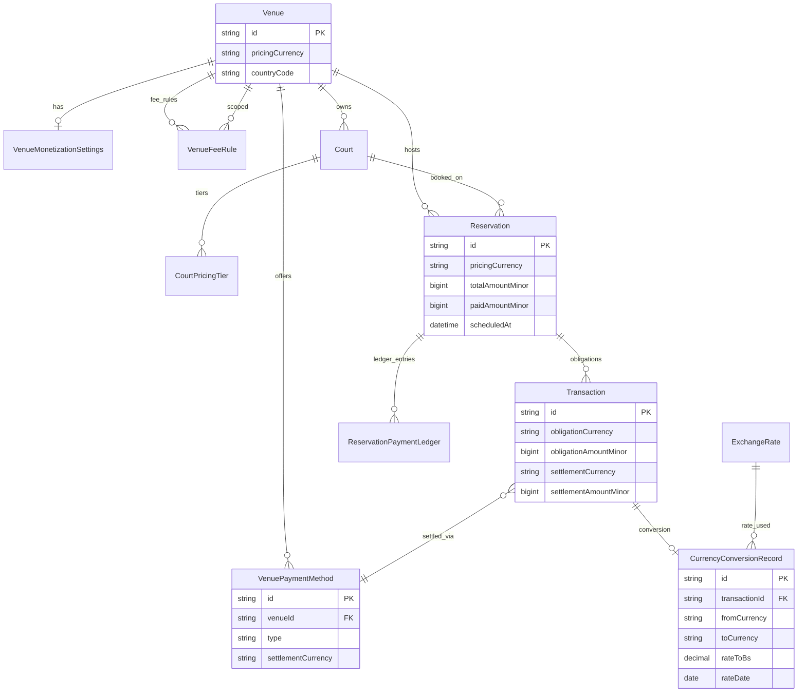
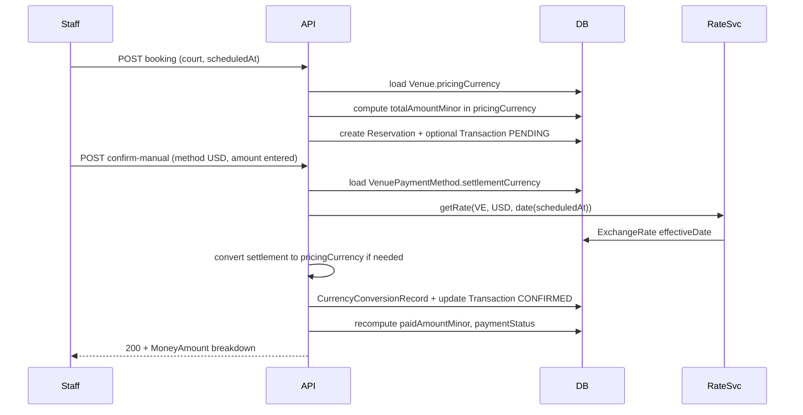

# Proposal: Modelo financiero multi-moneda (Cuadrala)

## Intent

Cuadrala opera en Venezuela con sedes que cotizan y cobran en **BS**, **USD** o **EUR**, pero el modelo actual mezcla montos sin `currencyCode`, asume implícitamente un símbolo `$` en UI y agrega pagos confirmados sin conversión explícita. Eso provoca errores de unidades (centavos vs unidades mayores), imposibilita auditoría de tasas y no soporta **varios medios del mismo tipo en distintas monedas de liquidación**.

Este cambio define un **modelo financiero fintech-aligned** (obligaciones + liquidación + trazabilidad de tipo de cambio), alineado con `docs/SDD.md` (ledger híbrido no custodial) y las decisiones de producto bloqueadas por PO.

## Problem

| Síntoma | Causa raíz |
|---------|------------|
| `paidAmountCents` / `totalAmountCents` sin moneda | Imposible sumar pagos USD + BS de forma segura |
| `Transaction.amount*` en unidades mayores sin moneda | `updateReservationPaymentFromTransactionRepo` multiplica ×100 asumiendo misma unidad que centavos de reserva |
| `$` hardcodeado en web | Ignora `Venue.displayCurrency` |
| `convertAmountToBsSV` sin uso en confirmación | Tipo de cambio no persiste en el flujo operativo |
| `FeeRule` global sin moneda ni venue | Fee no refleja negociación por sede ni moneda de pricing |
| `VenuePaymentMethod` sin `settlementCurrency` | No se puede distinguir transferencia BS vs USD |

## Goals

1. **Pricing claro:** `pricePerHourCents` y totales de reserva en **moneda de pricing de la sede** (`pricingCurrency`).
2. **Liquidación explícita:** cada pago confirmado registra monto en **moneda del medio** (`settlementCurrency`) y su equivalencia auditada.
3. **Tasa del día de reserva:** conversión con `ExchangeRate` vigente para la **fecha `scheduledAt`** (no confirmación), persistida en registro de auditoría.
4. **Fees en moneda de pricing:** comisión % por sede, calculada en la misma moneda que la cancha/reserva.
5. **Modelo completo on-paper** con entrega por fases (MVP operativo → ledger/reporting).
6. **API + web + mobile** coherentes en formato `MoneyAmount` (minor + `currencyCode`).

## Non-goals

- Custodia de fondos / wallet transaccional con saldo retirable (Etapa C en `docs/SDD.md`).
- Pasarela PSP integrada, webhooks y conciliación automática con banco (Fase 3 producto).
- Facturación fiscal SENIAT / emisión de facturas (solo preparar trazabilidad).
- Soporte de criptomonedas u otras monedas fuera de `BS | USD | EUR`.
- Revalorización histórica retroactiva masiva de tasas (solo forward + migración one-shot).

---

## Recomendación: modelo contable

### Opciones evaluadas

| Modelo | Descripción | Pros | Contras |
|--------|-------------|------|---------|
| **A. BS canónico único** | Todo se normaliza a centavos BS al escribir; UI convierte al vuelo | Reporting VE simple; un solo agregado | Sedes USD pierden UX; redondeo acumulado; pagos en USD “fantasma” en BS |
| **B. Ledger multi-moneda puro** | Saldos por `(user, currency)` sin BS | Fiel a operación real | Reporting VE costoso; riesgo de sumar monedas distintas |
| **C. Híbrido (recomendado)** | **Obligación y pricing** en `pricingCurrency`; **liquidación** en `settlementCurrency`; **BS de referencia** como snapshot derivado para reporting VE | Alinea operación, auditoría BCV y UX por sede; evita bugs de mezcla | Más columnas/tablas; migración cuidadosa |

### Decisión recomendada: **Modelo C — Híbrido de tres capas**

1. **Capa comercial (obligación):** montos en `pricingCurrency` de la sede — lo que ve el staff y el jugador.
2. **Capa de liquidación (pago):** montos en `settlementCurrency` del `VenuePaymentMethod` usado al confirmar.
3. **Capa de reporting VE (derivada, no fuente única):** `amountBsMinor` + `CurrencyConversionRecord` calculados con **tasa del día de la reserva** (`scheduledAt` date, timezone sede `America/Caracas`), inmutables tras confirmación.

**Rationale fintech (mercado VE):**

- **Inflación y dualidad BS/USD:** la obligación debe expresarse en la moneda en que la sede cotiza; forzar BS en pricing degrada adopción en sedes dolarizadas.
- **Reconciliación bancaria:** el cajero concilia en la moneda del medio (transferencia USD vs pago móvil BS); la liquidación debe coincidir con el extracto.
- **Auditoría regulatoria:** snapshots BS con `rateId`, `rateValue`, `rateDate` y `source` satisfacen trazabilidad sin reescribir histórico cuando cambia el tipo de cambio del día siguiente.
- **Agregación platform:** dashboards de Cuadrala pueden sumar `amountBsMinor` para revenue/fees; nunca sumar `amountMinor` cross-currency sin conversión.
- **Alineación SDD:** compatible con ledger inmutable por asientos (`ReservationPaymentLedger`) y confirmación manual no custodial.

`paidAmountCents` en `Reservation` pasa a significar **pagado acumulado en `pricingCurrency`** (minor units), no en BS implícito. Para sede BS coincide; para USD se actualiza en USD. Columna paralela opcional `paidAmountBsMinor` en Fase 2 solo para reporting.

Detalle de entidades y campos: [`design-notes.md`](./design-notes.md).

---

## Scope

### In Scope

- Enum `CurrencyCode` (`BS`, `USD`, `EUR`) y value object `MoneyAmount` (`amountMinor`, `currencyCode`).
- `Venue.pricingCurrency` (renombre semántico de `displayCurrency` con migración alias).
- `VenuePaymentMethod.settlementCurrency` + validación en settings.
- `Court` / `CourtPricingTier`: documentar que `pricePerHourCents` está en `venue.pricingCurrency`.
- `Reservation`: `pricingCurrency`, `totalAmountMinor`, `paidAmountMinor` (migración desde `*Cents`).
- `Transaction`: monedas de obligación y liquidación; snapshots de conversión.
- `CurrencyConversionRecord` + `ExchangeRate` con vigencia por fecha.
- `VenueMonetizationSettings` + `VenueFeeRule` (fee % negociado por sede, moneda = pricing).
- Servicio de dominio `MoneyConversionService` + uso en confirmación manual.
- API contracts, validación Zod, mappers Prisma.
- Web: `ReservationDetailModal`, `PaymentMethodsSettings`, formateo por moneda.
- Mobile: pantallas de pago/reserva equivalentes (lectura + confirmación staff).
- Migración datos existentes + tests TDD (unit + contract + integración crítica).

### Out of Scope

- Pasarela, webhooks, idempotencia PSP.
- `wallet_ledger` multi-usuario con saldo (Fase 2 ledger completo).
- Reembolsos automáticos y asientos compensatorios UI (solo modelo preparado).
- Multi-país fuera de VE (`countryCode` fijo `VE` en MVP).

---

## Capabilities

### New Capabilities

- `money-types`: `CurrencyCode`, `MoneyAmount`, reglas de redondeo por moneda (2 decimales BS/USD/EUR).
- `venue-pricing-currency`: configuración `pricingCurrency` por sede y propagación a canchas/reservas.
- `venue-payment-methods-multi-currency`: métodos con `settlementCurrency`, duplicados por tipo permitidos.
- `exchange-rate-by-date`: tasas diarias `VE` + snapshot en confirmación (fecha = día de reserva).
- `reservation-payment-aggregation`: `paidAmount` / `paymentStatus` en moneda de pricing con conversión desde liquidación.
- `venue-fee-rules`: `FeeRule` scoped por `venueId`, fee en `pricingCurrency`.
- `reservation-payment-ledger` (Fase 2): asientos inmutables post-confirmación.

### Modified Capabilities

- `monetization-transactions`: obligaciones y confirmación con monedas explícitas; deprecar suma ciega `amountTotal`.
- `reservation-billing`: cálculo de total desde cancha en moneda de sede.
- `backoffice-schedule-ui`: formateo y validación de montos según moneda (sin `$` fijo).

---

## Approach

1. **Schema-first:** Prisma + migraciones backward-compatible (columnas nuevas, backfill, luego deprecar).
2. **Domain `MoneyAmount`:** sin Prisma en domain; mappers en infrastructure.
3. **`PaymentOrchestrator` (application):** crear obligación → confirmar → escribir `CurrencyConversionRecord` → actualizar agregados de reserva.
4. **Tasa:** `getRateForDateSV(countryCode, currency, reservationLocalDate)`; error 422 si falta tasa del día.
5. **Confirmación:** staff elige `venuePaymentMethodId` → sistema valida `settlementCurrency` → convierte a `pricingCurrency` si difiere → persiste ambos montos + snapshot BS.
6. **UI:** `formatMoney(minor, currencyCode)` compartido web/mobile.

Ver diagramas y secuencias en [`design-notes.md`](./design-notes.md).

---

## Entity model (resumen)

| Entidad | Cambio principal |
|---------|------------------|
| `Venue` | `pricingCurrency` (BS\|USD\|EUR), `countryCode` default `VE` |
| `VenueMonetizationSettings` | 1:1 venue: timezone, redondeo, política overpayment |
| `VenuePaymentMethod` | `settlementCurrency`, unique opcional `(venueId, type, name)` |
| `Court` / `CourtPricingTier` | sin cambio de nombre; semántica documentada |
| `Reservation` | `pricingCurrency`, `totalAmountMinor`, `paidAmountMinor`, `paymentStatus` |
| `VenueFeeRule` | `venueId`, `scope`, `type`, `value`, `currencyCode` |
| `Transaction` | `obligationCurrency`, `obligationAmountMinor`, `settlementCurrency`, `settlementAmountMinor`, `pricingCurrency`, `appliedRateId` |
| `CurrencyConversionRecord` | auditoría: from/to, rate, date, source |
| `ExchangeRate` | `effectiveDate`, unique `(countryCode, currency, effectiveDate)` |
| `ReservationPaymentLedger` (Fase 2) | asientos DEBIT/CREDIT inmutables |

---

## ER diagram

---

## Key flows (sequence)

### Crear reserva → obligación → confirmar (USD method, pricing USD)

### Confirmar con método BS en sede USD (cross-currency)

1. Obligación restante: `50_00 USD` (5000 minor).
2. Staff registra pago: `2_750_000 BS` minor vía PAGO_MOVIL BS.
3. Sistema aplica `rateToBs` del **día de `scheduledAt`**, obtiene equivalente USD, cap a pendiente, persiste `settlementAmountMinor` BS + `appliedToObligationMinor` USD + `CurrencyConversionRecord`.

---

## API & UI changes

| Package | Cambios |
|---------|---------|
| **services/api** | Prisma schema; `MoneyAmount` domain; `monetization.service` + `ConfirmTransactionAsVenueStaffUseCase`; repos; Zod en `monetization.validation`; DTOs con `{ amountMinor, currencyCode }`; endpoints venue settings, payment methods, reservations, transactions; seed tasas diarias |
| **apps/web** | `formatMoney`; `ReservationDetailModal` sin `$` fijo; `PaymentMethodsSettings` selector moneda; types `api.ts`; tests Vitest |
| **apps/mobile** | Modelos API; formateo en detalle reserva/pago; settings sede (si aplica staff) |

**Breaking (controlado):** respuestas JSON incluyen `currencyCode`; clientes deben leer minor + currency. Período de compat: campos legacy `*Cents` rellenados solo si `currencyCode === pricingCurrency`.

---

## Migration strategy

1. **Add columns** nullable: `pricingCurrency`, `*Minor`, `settlementCurrency`, etc.
2. **Backfill:** `pricingCurrency = venue.displayCurrency ?? 'BS'`; `totalAmountMinor = totalAmountCents`; transactions: asumir BS si venue BS, else pricingCurrency con revisión manual flag `needsReview`.
3. **ExchangeRate:** poblar filas por `effectiveDate` desde histórico `updatedAt` o seed; job diario.
4. **Dual-write** una release: escribir nuevo + legacy cents.
5. **Cutover:** lectura solo `MoneyAmount`; deprecar escritura `*Cents`.
6. **Cleanup migration** (Fase 2): drop columnas legacy tras verificación.

Rollback: feature flag `MULTI_CURRENCY_PAYMENTS=false` → lectura legacy; migraciones forward-only — rollback DB vía migración inversa preparada, no en prod sin ventana.

---

## Phased roadmap

### Phase 1 — MVP shippable (P0)

- `CurrencyCode` + `MoneyAmount` en API/domain
- `Venue.pricingCurrency`, `VenuePaymentMethod.settlementCurrency`
- `Reservation` moneda + agregación `paid` en pricing currency
- Confirmación manual con `CurrencyConversionRecord` (tasa día reserva)
- `VenueFeeRule` por sede; fee en pricing currency
- Web: formateo + settings + modal reserva
- Migración backfill + tests críticos

### Phase 2 — Ledger & reporting (P1)

- `ReservationPaymentLedger` inmutable + asientos compensatorios API interna
- `paidAmountBsMinor` / reportes platform agregados BS
- Conciliación diaria (job) + cola excepciones
- Mobile paridad completa staff
- Deprecación columnas `*Cents` sin moneda

### Phase 3 — Integración externa (producto SDD, fuera de este change)

- PSP, webhooks, idempotencia, refunds

---

## Affected Areas

| Area | Impact | Description |
|------|--------|-------------|
| `services/api/prisma/schema.prisma` | Modified | Nuevos campos/entidades/enums |
| `services/api/src/domain/` | New | `MoneyAmount`, ports conversión |
| `services/api/src/application/monetization.service.ts` | Modified | Conversión y agregación |
| `services/api/src/application/use_cases/confirm_transaction_*` | Modified | Snapshot tasa + monedas |
| `services/api/src/infrastructure/repositories/` | Modified | Mappers money |
| `services/api/src/presentation/validation/` | Modified | Zod money |
| `apps/web/src/components/schedule/ReservationDetailModal.tsx` | Modified | Formateo multi-moneda |
| `apps/web/src/components/settings/PaymentMethodsSettings.tsx` | Modified | settlementCurrency |
| `apps/mobile/lib/src/features/` | Modified | Pago/reserva (Fase 1 lectura, Fase 2 staff) |
| `docs/SDD.md` | Modified (post-archive) | Alinear FR monetización con modelo híbrido |

---

## Risks

| Risk | Likelihood | Mitigation |
|------|------------|------------|
| Backfill incorrecto en datos históricos | Med | Flag `needsReview`; script validación; muestreo manual sedes USD |
| Falta tasa del día de reserva | Med | 422 claro; seed + job; fallback admin solo con permiso auditado |
| Regresión suma pagos | High | Tests obligatorios cross-currency; prohibir sum sin currency en linter/domain |
| PR > 400 líneas | High | Chained PRs: schema → API core → web → mobile |
| Scope creep ledger Fase 1 | Med | `ReservationPaymentLedger` solo Fase 2; Fase 1 conversion record suficiente |

### Open items (no bloqueados por PO)

- Zona horaria exacta para “día de reserva” si `scheduledAt` UTC cruza medianoche VE (default: `America/Caracas`).
- Política de sobrepago: ¿aceptar crédito a favor o rechazar? (recomendación MVP: rechazar con tolerancia 1 minor unit).
- ¿`VenueFeeRule` reemplaza `FeeRule` global o conviven? (recomendación: venue override, fallback global MATCH).

---

## Rollback Plan

1. Desactivar flag `MULTI_CURRENCY_PAYMENTS` en API (lectura/escritura legacy).
2. Revertir deploy aplicación sin revertir migración si columnas legacy siguen pobladas (dual-write).
3. Si migración destructiva ya aplicada: ejecutar migración down documentada + restaurar backup DB (ventana mantenimiento).
4. Web/mobile: revert a build anterior que ignore `currencyCode`.

---

## Dependencies

- PostgreSQL + Prisma migrate
- Fuente tasas (`ExchangeRate` seed / integración dolarapi existente)
- Coordinación PO/Legal: textos T&C “no custodia” sin cambio regulatorio en Fase 1

---

## Success Criteria

- [ ] Reserva USD muestra totales y pagos en USD sin símbolo `$` hardcodeado.
- [ ] Confirmación con método BS en sede USD actualiza `paidAmountMinor` correcto y persiste `CurrencyConversionRecord` con tasa del día de `scheduledAt`.
- [ ] Dos `BANK_TRANSFER` activos (BS y USD) coexisten en misma sede.
- [ ] Fee % por sede se calcula en `pricingCurrency` y aparece en obligación.
- [ ] Tests API: conversión, agregación, 422 sin tasa, contract JSON con `currencyCode`.
- [ ] Cero sumas de `amountMinor` sin `currencyCode` en código de agregación (grep/CI).
- [ ] Documentación spec lista para `sdd-spec` (Given/When/Then por capability).

---

## Success metrics (for sdd-spec)

| Métrica | Objetivo |
|---------|----------|
| Defectos unidad moneda post-release | 0 P0 en 30 días |
| Reservas `needsReview` tras migración | < 5% |
| Cobertura tests monetización | 100% paths conversión en unit |
| Tiempo confirmación staff | Sin regresión > 10% vs baseline |

---

## Next steps

- **sdd-spec:** escenarios por capability (RFC 2119).
- **sdd-design:** secuencias DI, interfaces `LedgerService`, migraciones detalladas.
- Ejecutar en paralelo tras aprobación de esta propuesta.
