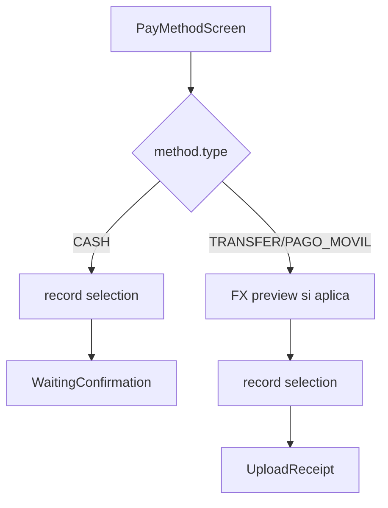

# Design: mobile-match-payments-fx

## Mobile

- `core/formatting/money_conversion.dart` — port de `apps/web/src/lib/money-conversion.ts`
- `core/data/exchange_rates_api.dart` + repository — `GET /countries/:code/exchange-rates`
- `PayMethodScreen`: bootstrap carga venue + match + rates; `_continue()` bifurca CASH → `WaitingConfirmationScreen` vs upload
- Widget `_SettlementConversionCard` cuando obligation ≠ settlement

## API

- `VenueDetailDTO.countryCode` en `getVenueDetailSV`
- `TransactionReceiptAccessRepository.getPlayerPaymentMethodTypeSV`
- `UploadTransactionReceiptUseCase`: 400 si type === CASH

## Flujo

