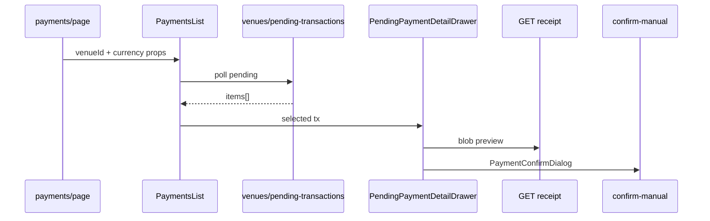

# Design: web-pending-payments-queue

## Módulos

| Capa | Artefacto | Responsabilidad |
|------|-----------|-----------------|
| API domain | `PendingStaffTransactionRow` | Contrato enriquecido para staff |
| API infra | `prisma_payment_transaction_mapper` | Mapeo Prisma → row (payer, receipt, context) |
| API infra | `prisma_payment_transaction_repository` | `listPendingByVenueSV` con includes |
| API infra | `prisma_transaction_receipt_access_repository` | Staff de sede puede leer comprobante |
| API application | `ListVenuePendingTransactionsUseCase` | DTO de salida |
| Web | `PaymentsList` | Cola + polling + drawer |
| Web | `PendingPaymentDetailDrawer` | Preview, confirm, reject |
| Web | `payments/page.tsx` | Tabs Resumen \| Pendientes |

## Flujo staff

## Decisiones

1. **Enriquecer en mapper**, no en controller — un solo punto de verdad Prisma→DTO.
2. **Receipt access** — staff con rol en `venueId` de la transacción (match.court o reservation).
3. **Confirmación** — reutilizar `PaymentConfirmDialog` cuando hay `reservationId`; si no, mensaje en drawer (deuda técnica).
4. **Polling** — 30s en `PaymentsList` para cola viva sin websockets.

## API shape (pending item)

Campos clave: `payerName`, `payerEmail`, `contextLabel`, `receiptId`, `obligationAmountMinor`, `obligationCurrency`, `reservationId`, `matchId`, `scheduledAt`, `courtName`.
