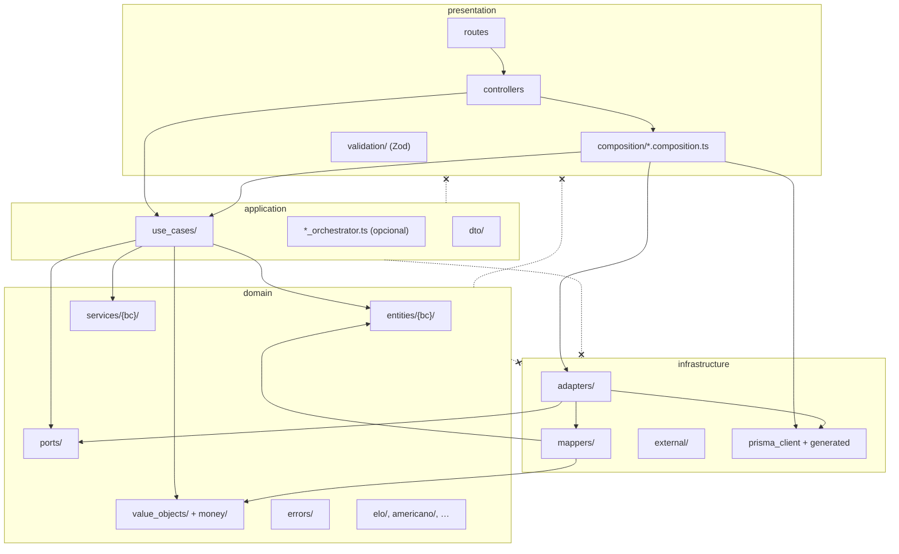

# Arquitectura — `services/api`

Documento de referencia para el API de Cuadrala. Describe la **arquitectura objetivo** (Clean Architecture / hexagonal) y el estado de migración desde el código legacy.

**Programa de migración:** [`openspec/changes/api-architecture-refactor/`](../../openspec/changes/api-architecture-refactor/) (olas 0–6).

**Reglas Cursor:** [`.cursor/rules/clean-architecture.mdc`](../../.cursor/rules/clean-architecture.mdc).

---

## 1. Principio: dependencias hacia dentro

Las capas externas dependen de las internas. **Nunca** al revés.



`presentation/composition/` es la **única** parte de presentation que MAY importar `infrastructure/`.

---

## 2. Reglas inviolables

| # | Regla | Verificación |
|---|--------|----------------|
| 1 | `domain/` y `application/` MUST NOT importar `infrastructure/` ni `src/generated/prisma` | ESLint `no-restricted-imports` (Wave 0+) |
| 2 | `presentation/controllers/` MUST NOT importar `infrastructure/` ni Prisma | ESLint + review |
| 3 | `presentation/routes/` MUST NOT importar repos/adapters ni `*.service.ts` | ESLint + review |
| 4 | Cada endpoint MUST delegar en un **use case**; prohibido crear nuevos `application/*.service.ts` | Lint + convención equipo |
| 5 | Montos MUST usar `MoneyAmount` / `CurrencyCode` en `domain/money/` (post Wave 0) | Tests + review |

**Orden de verificación en CI:** `npm run typecheck` → `npm run lint` → `npm test`.

---

## 3. Árbol de carpetas (`src/`)

```text
src/
  domain/                 # Lógica de negocio pura — cero frameworks
    errors/
    money/                # Wave 0: CurrencyCode, MoneyAmount, …
    value_objects/
    entities/
      booking/            # reservation, court, …
      payments/           # exchange_rate, venue_payment_method, …
    services/             # Domain services sin IO (por BC)
      payments/
      booking/
    ports/                # Contratos (IXxxRepository) — NO usar domain/repositories/
    elo/                  # Algoritmos puros legacy
    americano/
    …
  application/
    use_cases/            # Un archivo ≈ una acción de negocio
    dto/
    validation/           # Solo reglas sin IO (excepcional)
  infrastructure/
    adapters/             # Implementaciones de ports (Prisma*, external APIs)
    mappers/              # Prisma row → entity / VO
    external/
    repositories/         # ⚠️ LEGACY — funciones findXRepo; deprecar → adapters
    prisma_client.ts
  presentation/
    composition/          # Único composition root (DI)
    controllers/
    routes/
    validation/           # Zod — formato HTTP
    middleware/
  generated/prisma/       # Auto-generado — NO editar
```

### 3.1 Domain: `ports/` vs `infrastructure/repositories/`

| Ubicación | Qué es | Estado |
|-----------|--------|--------|
| `domain/ports/` | Interfaces que application consume | **Target** — ~62 ports |
| `domain/repositories/` | Carpeta vacía (scaffold) | **Eliminar** en Wave 0 |
| `infrastructure/repositories/` | Funciones procedurales `findXRepo` | **Legacy** — 15 archivos; migrar a `adapters/` |

La confusión de nombres se resuelve con este documento y ESLint, **no** renombrando `ports/` a `repositories/` en domain.

### 3.2 Domain: `entities/` por bounded context

Entidades en `domain/entities/{bc}/` (ej. `booking/`, `payments/`). Sin decoradores Prisma. Los mappers en infrastructure traducen filas Prisma → entidades.

### 3.3 Application: use cases, no god services

| Patrón | Estado |
|--------|--------|
| `application/use_cases/*.use_case.ts` + ports inyectados | **Target** (~89 archivos) |
| `application/*.service.ts` (9 god services) | **Legacy** — eliminar por ola |

Orquestadores delgados (`PaymentOrchestrator`, etc.) MAY existir en application **sin** importar infrastructure.

### 3.4 Infrastructure: adapters + mappers

- **Adapter:** clase `PrismaXxxAdapter` (o `PrismaXxxRepository` si ya existe) implementa el port.
- **Mapper:** funciones/clases que convierten tipos Prisma → `entities/` / `money/`.
- **Prohibido:** exponer tipos `generated/prisma` fuera de infrastructure (salvo composition al instanciar adapters).

### 3.5 Presentation: composition root

Todo wiring en `presentation/composition/{feature}.composition.ts`:

- Instanciar adapters (y `PRISMA` solo aquí si el ctor lo requiere).
- Instanciar use cases con ports.
- Exportar **solo** constantes `*_UC` en UPPER_SNAKE.

Los controllers importan únicamente `*_UC` desde composition (+ errores domain + tipos DTO si aplica).

Validación HTTP: **solo** `presentation/validation/*.validation.ts` (Zod). No crear archivos en `presentation/validators/`.

---

## 4. Patrones de referencia (copiar)

### 4.1 Gold — `transaction_receipts.composition.ts`

- Adapters instanciados una vez en el módulo.
- Use cases exportados como `UPLOAD_TRANSACTION_RECEIPT_UC`, `GET_TRANSACTION_RECEIPT_UC`.
- Cross-feature: importa `CREATE_PAYMENT_PENDING_NOTIFICATION_EVENT_UC` de otra composition.
- Use case **no** recibe `PRISMA` directamente.

```typescript
// presentation/composition/transaction_receipts.composition.ts (extracto)
const TRANSACTION_RECEIPT_REPOSITORY = new PrismaTransactionReceiptRepository();

export const UPLOAD_TRANSACTION_RECEIPT_UC = new UploadTransactionReceiptUseCase(
  RECEIPT_STORAGE,
  TRANSACTION_RECEIPT_REPOSITORY,
  RECEIPT_ACCESS_REPOSITORY,
  RECEIPT_NOTIFY_CONTEXT_REPOSITORY,
  CREATE_PAYMENT_PENDING_NOTIFICATION_EVENT_UC,
);
```

### 4.2 Gold — `matches.composition.ts`

- Múltiples adapters por agregado, export de muchos `*_UC`.
- Controller: `import { LIST_OPEN_MATCHES_UC } from '../composition/matches.composition.js'`.

**Deuda conocida:** `GET_MATCH_PAYMENT_INFO_UC` aún recibe `PRISMA` — corregir en Wave 1/3 (pasar port, no cliente Prisma al UC).

### 4.3 Gold — use case con ports

```typescript
// application/use_cases/confirm_transaction_as_venue_staff.use_case.ts (patrón)
export class ConfirmTransactionAsVenueStaffUseCase {
  constructor(
    private readonly _transactionRepository: ITransactionRepository,
    // … solo interfaces de domain/ports
  ) {}
}
```

### 4.4 Anti-patrón — DI inline en controller

`bookings.composition.ts` **existe** pero `bookings.controller.ts` **no lo importa** y re-cablea Prisma/repos a mano. **No copiar.**

### 4.5 Anti-patrón — god service + repos función

~~`monetization.service.ts`~~ eliminado; flujos en `monetization.composition.ts` + use cases (Wave 1).

### 4.6 Anti-patrón — router con infra

`exchange_rate.router.ts` y `venue_payment_method.router.ts` llaman repos/Prisma directamente. Target: router → controller → UC (Wave 1 / 6).

---

## 5. Controllers con deuda (manifest)

| Controller | Problema | Ola |
|------------|----------|-----|
| `bookings.controller.ts` | DI inline; ignora composition | 2 |
| `reservations.controller.ts` | DI inline | 2 |
| `venues.controller.ts` | `court_repository_factory` en controller | 2 |
| `venue_dashboard.controller.ts` | Prisma + repos | 1 + 2 |
| `list_venue_matches.controller.ts` | repos en controller | 2 |
| `court_pricing.controller.ts` | PRISMA directo | 2 |
| `tournaments.controller.ts` | PRISMA directo | 3 |
| `user_search.controller.ts` | `user.repository` | 4 |
| `americano.controller.ts` | llama `americano.service` | 3 |

---

## 6. ESLint (estado y roadmap)

**Activo (`eslint.config.mjs`, Wave 0 PR2):**

| Glob | Reglas | Severidad |
|------|--------|-----------|
| `src/domain/**` | `infrastructure/`, `generated/prisma`, `presentation/`, `application/` | `warn` |
| `src/application/**` | `infrastructure/`, `generated/prisma`, `presentation/`; imports `*.service.js` | `warn` |
| `src/presentation/controllers/**` | `infrastructure/`, `generated/prisma` | `warn` |
| `src/presentation/routes/**` | `infrastructure/`, `application/**/*.service` | `warn` |

`presentation/composition/**` **no** tiene restricción extra (único lugar permitido para wiring a adapters).

**Severidad:** `'error'` (Wave 0 cerrado). Excepciones temporales en `eslint.config.mjs` (`APPLICATION_LEGACY_PRISMA_USE_CASES`, `PRESENTATION_LEGACY_*`) — eliminar en Waves 1–2.

**Overrides `eslint-disable-next-line`:** máximo **1 sprint**, con ticket/issue vinculado en el comentario. No usar en archivos nuevos.

**Inventario violadores (baseline):** ~10 `application/**`, ~9 `controllers/**`, ~2 `routes/**` — ver [`exploration.md`](../../openspec/changes/api-architecture-refactor/exploration.md) §1.1 y §7.

Detalle de patrones: [`design.md`](../../openspec/changes/api-architecture-refactor/design.md) §5.

---

## 7. Dinero (`domain/money/`)

Postura **fintech global** (no MVP):

- `MoneyAmount`: clase inmutable con `amountMinor: bigint` y `currencyCode: CurrencyCode`.
- `CurrencyCode`: `BS` | `USD` | `EUR` (`currency_code.ts`).
- Helpers: `money_amount_ops.ts` (`addMoney`, `subtractMoney`, `assertSameCurrency`).
- Errores: `money_errors.ts` (`InvalidCurrencyCodeError`, `CurrencyMismatchError`, …).
- Suma/resta **solo** misma moneda; cross-currency vía conversión (Wave 1 / MCP).
- Tests: `src/test/unit/money_amount.test.ts`.
- Sin tipos Prisma en domain ni application.

Detalle producto multi-moneda: change [`multi-currency-payments`](../../openspec/changes/multi-currency-payments/) — **bloqueado** hasta Wave 0 + [`payment-domain-refactor`](../../openspec/changes/payment-domain-refactor/).

---

## 8. Olas de migración (resumen)

| Ola | Foco | Gate |
|-----|------|------|
| **0** | Este doc, ESLint, `domain/money`, entities por BC, validation unificada | Lint verde capas domain/application |
| **1** | BC Payments (`payment-domain-refactor`) | **Desbloquea MCP** |
| **2** | Booking & Venue — usar `bookings.composition` |
| **3** | Match & Tournament |
| **4** | Identity (auth, profile) |
| **5** | Social (chat, notifications) |
| **6** | Platform — eliminar 15 repos función |

```text
Wave 0 → Wave 1 (payments) → GATE MCP → Waves 2–6
```

Tareas ejecutables: [`openspec/changes/api-architecture-refactor/tasks.md`](../../openspec/changes/api-architecture-refactor/tasks.md).

---

## 9. Convenciones de código (API)

| Elemento | Convención |
|----------|------------|
| Use cases | `*.use_case.ts`, clase `XxxUseCase` |
| Composition exports | `UPPER_SNAKE` + sufijo `_UC` |
| Ports | `IThingRepository` en `domain/ports/` |
| Adapters | `PrismaThingAdapter` en `infrastructure/adapters/` |
| Validación HTTP | `presentation/validation/*.validation.ts` |
| Mensajes usuario | Español |
| Identificadores código | Inglés |

Ver también [`.cursor/rules/naming-conventions.mdc`](../../.cursor/rules/naming-conventions.mdc) (SV/CON en capa legacy presentation).

---

## 10. Cómo añadir un endpoint nuevo (checklist)

1. Definir o reutilizar port en `domain/ports/`.
2. Implementar adapter en `infrastructure/adapters/` + mapper si aplica.
3. Crear `application/use_cases/{action}.use_case.ts` (solo ports + domain).
4. Registrar en `presentation/composition/{feature}.composition.ts` → export `ACTION_UC`.
5. Controller skinny: parsear req, llamar `ACTION_UC.execute(dto)`, mapear respuesta HTTP.
6. Zod en `presentation/validation/`.
7. Tests: unit del UC; contract/integration según `openspec/config.yaml`.

**No crear:** `*.service.ts` en application, funciones en `infrastructure/repositories/`, imports de Prisma en UC.

---

## 11. Referencias

| Recurso | Ruta |
|---------|------|
| Schema DB | `prisma/schema.prisma` |
| Setup API | `README.md` |
| Spec programa | `openspec/changes/api-architecture-refactor/spec.md` |
| Design técnico | `openspec/changes/api-architecture-refactor/design.md` |
| Exploración AS-IS | `openspec/changes/api-architecture-refactor/exploration.md` |
| AGENTS monorepo | `../../AGENTS.md` |
